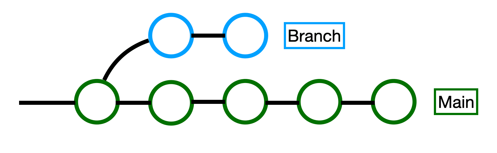
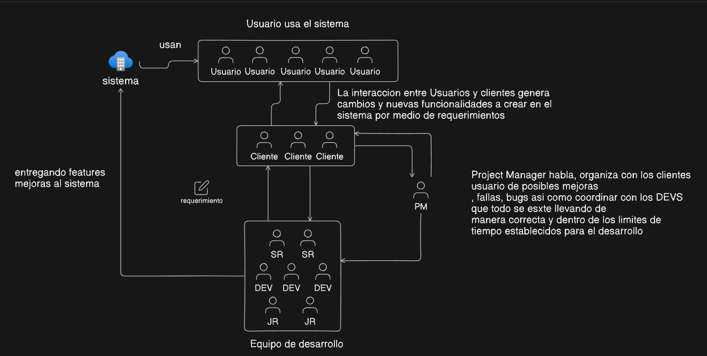
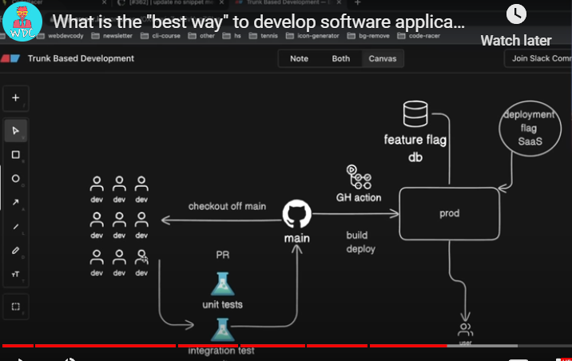

# DAY 1 - GUIA

### Saludo y Bienvenida
Buenas tardes a todos, y bienvenidos al Bootcamp DIA 1. 
Es un honor estar aquí con ustedes, un grupo selecto de profesionales de Digital FEMSA que ha demostrado un compromiso excepcional con la excelencia en sus respectivos departamentos 
y proyectos. Este bootcamp ha sido diseñado especialmente para ustedes, con el objetivo de potenciar sus habilidades y prepararlos para desafíos aún mayores en el mundo del desarrollo de software.

### Introducción Personal
Permitanme presentarme brevemente. Mi nombre es Luis, y tengo más de 12 años de experiencia trabajando en desarrollo de software. 
Actualmente, ocupo el cargo de Senior Developer, he liderado numerosos proyectos basados en tecnologías Java a lo largo de mi carrera. 

### Visión General del Curso y Áreas de Oportunidad
Durante este bootcamp, nos enfocaremos en áreas clave de habilidades, seleccionadas específicamente para alinear con las oportunidades de crecimiento identificadas para cada uno de ustedes.

### Presentacion de Alejandro como Teacher Assistant

## GIT [40 minutos aproximadamente por tema]

### Mostrar CANVA DIA 1
- Explicar los temas que vamos a tratar en el día 1
- Git se centra en un concepto llamado Control de Versiones
  - ¿Hay alguien que no sepa que es control de versiones?
  - Pregunta a los alumnos Que es el Control de Versiones
    - Presentar el problema y porque surge el control de versiones
      - Abre un directorio y crea un archivo y llámalo "mi_tesis_revolucionaria.txt"
        - crea otro archivo llamado "mi_tesis_revolucionaria_rev1.txt"
        - crea otro archivo llamado "mi_tesis_revolucionaria_rev2.txt"
        - crea otro archivo llamado "mi_tesis_revolucionaria_revision_sinodal.txt"
        - crea otro archivo llamado "mi_tesis_revolucionaria_revision_sinodal01.txt"
- GIT es importante porque da solucion al control de las versiones de todos los archivos de nuestro proyecto 
  - Permite a los equipos de desarrollo colaborar de manera eficiente en proyectos de software. 
  - Proporciona un control robusto de versiones, facilitando la gestión de cambios al código fuente a lo largo del tiempo. 
  - GIT ayuda a prevenir conflictos entre diferentes versiones del mismo archivo y permite a los desarrolladores trabajar en paralelo en diversas características sin interferir unos con otros. 
  - Además, su capacidad para revertir a versiones anteriores del software y crear ramificaciones para experimentación sin afectar el código principal lo hace esencial para el mantenimiento y la iteración continuos de proyectos de desarrollo de software.
  - ¿Todos entendemos hasta este punto lo que es GIT de manera conceptual?
- Mini Lab 101 GIT repaso
  - comandos basicos
- Branching
  
  - En Git, una "branch" o rama representa una línea independiente de desarrollo. 
  - Las ramas se utilizan para desarrollar funcionalidades aisladas unas de otras. 
  - La rama principal de Git, por defecto llamada "master" (ahora a menudo renombrada a "main" en muchos proyectos para evitar connotaciones negativas), contiene el historial oficial del proyecto y es el codigo productivo. 
  - Las ramas adicionales se utilizan para desarrollar nuevas funcionalidades antes de que se integren en la rama principal.
  - Crear ramas en Git permite a los desarrolladores trabajar en una parte del proyecto sin afectar al resto. Esto es especialmente útil en entornos donde múltiples desarrolladores están trabajando en el mismo proyecto simultáneamente, ya que permite:
    - Experimentación y desarrollo seguros: Los desarrolladores pueden hacer cambios en una rama sin afectar la estabilidad de la rama principal. 
    - Facilita la revisión de código: Antes de que los cambios en una rama se fusionen con la rama principal, pueden ser revisados por otros desarrolladores. 
    - Manejo eficiente de funcionalidades: Cada rama puede estar dedicada a una funcionalidad específica o a una tarea, manteniendo organizado el flujo de trabajo del desarrollo. 
    - En la práctica, trabajar con ramas en Git involucra varios comandos clave, como git branch para crear y listar ramas, git checkout para cambiar entre ramas, y git merge para fusionar los cambios de una rama a otra.
  - Mini lab 2
- Pull requests
  - Un Pull Request (PR) es una funcionalidad de sistemas de gestión de versiones basados en Git, como GitHub, GitLab y Bitbucket. Permite a los desarrolladores decirle a otros en el equipo que han completado una serie de cambios en una rama del repositorio. El PR solicita que esos cambios sean revisados y potencialmente integrados (merge) a la rama principal del proyecto, típicamente la rama main o master. 
  - Buenas Prácticas para el Code Review en Pull Requests 
    - Revisar con objetividad: Mantén una perspectiva objetiva y enfócate en mejorar la calidad del código y la funcionalidad del proyecto. Evita comentarios personales que no estén directamente relacionados con el código. 
    - Describir, no prescribir: En lugar de decir "cambia esto", es mejor describir el problema y sugerir posibles soluciones. Esto fomenta un diálogo constructivo y la colaboración. 
    - Pequeños pull requests: Los PRs deben ser lo suficientemente pequeños como para que un revisor los pueda entender y revisar en un tiempo razonable. Pull requests grandes tienden a ser abrumadores y es más probable que pasen por alto errores. 
    - Escribir buenos comentarios en los commits y en el PR: Los mensajes de commit deben ser claros y reflejar los cambios realizados. Asimismo, la descripción del PR debe ofrecer un contexto adecuado, explicar las razones detrás de los cambios, y listar los posibles efectos secundarios o áreas de preocupación. 
    - Automatizar lo que se pueda: Utiliza herramientas de integración continua (CI) y revisión automática de código para detectar problemas antes de que lleguen a los revisores humanos. Esto incluye errores de sintaxis, estándares de codificación y pruebas fallidas. 
    - Responder a todos los comentarios: El autor del PR debe responder a cada comentario, ya sea para hacer una corrección, discutir un punto o simplemente para confirmar que ha leído el comentario. 
    - Realizar pruebas adecuadas: Asegúrate de que el código tenga pruebas adecuadas (unitarias, de integración, etc.) que verifiquen su funcionamiento y eviten regresiones en el futuro. 
    - Revisar el código localmente: Si es posible, revisa el código en tu entorno local. A veces, ver el código en acción puede ayudarte a detectar problemas que no son evidentes en el código por sí solo. 
    - Mantener un tono respetuoso y constructivo: La manera en que se comunican los comentarios puede afectar cómo son recibidos. Intenta ser alentador y abierto a las ideas de los demás. 
    - Fomentar la mejora continua: Usa las revisiones de código como oportunidades para aprender y enseñar. Compartir conocimientos y técnicas puede mejorar al equipo en su conjunto.

Estas prácticas pueden ayudar a que los pull requests y las revisiones de código sean más efectivos y contribuyan positivamente al desarrollo del proyecto y al crecimiento profesional del equipo.

### Abrir [eraser](https://app.eraser.io/workspace/sK1AOs3JIK1Ysc5NQVzP)
#### Empezar con tema **Desarrollo de software usando GIT para grandes empresas.**
Voy a presentar de manera muy general como es que se lleva acabo el management de un equipo de desarrollo de software
Cada empresa lo puede implementar de manera muy especifica
Empezar a doodolear la siguiente imagen la cual representa el management de un proyecto a nivel general

Roles
- PM project Manager: Project Manager habla, organiza con los clientes usuario de posibles mejoras, fallas, bugs asi como coordinar con los DEVS que todo se este llevando de manera correcta y dentro de los limites de tiempo establecidos para el desarrollo
- Usuario: usa el sistema
- Cliente: Es una persona que interactua con los usuarios y el equipo de desarrollo.
- Equipo de desarrollo: Es el encargado de desarrollar features/mejoras y corregir bugs en el sistema
  - SR: Un desarrollador senior es un profesional del desarrollo de software con amplia experiencia y conocimientos técnicos avanzados. Estas son algunas de sus características clave:
    - Habilidades Técnicas: Dominio en lenguajes de programación, patrones de diseño y arquitectura de sistemas. 
    - Resolución de Problemas: Capacidad para abordar y resolver problemas complejos de forma eficiente. 
    - Liderazgo y Mentoría: Actúan como mentores para desarrolladores menos experimentados, liderando equipos y proyectos. 
    - Comunicación: Habilidades efectivas de comunicación para colaborar con equipos y comunicarse con stakeholders no técnicos. 
    - Aprendizaje Continuo: Compromiso con el aprendizaje y la adaptación a nuevas tecnologías y prácticas. 
    - Visión Estratégica: Contribuyen a la estrategia tecnológica de la organización y toman decisiones clave que afectan a largo plazo. 
    - En resumen, un desarrollador senior es no solo un experto en programación, sino también un líder estratégico dentro de su equipo o empresa.
  - Tech Lead
    - Liderazgo Técnico: No solo es un experto técnico, sino también el líder técnico del equipo. Su responsabilidad es guiar todo el aspecto técnico del proyecto.
    - Gestión y Coordinación: Coordina la carga de trabajo técnica, toma decisiones clave en el diseño y la implementación, y asegura que el equipo cumpla con los objetivos técnicos.
    - Comunicación: Actúa como el principal punto de contacto técnico entre el equipo de desarrollo y otros stakeholders, incluyendo la gestión, clientes, y otros equipos.
    - Visión Estratégica: Responsable de la visión técnica a largo plazo del proyecto, asegurando que las decisiones técnicas apoyen los objetivos globales del negocio o del producto.
  - Similitudes y Diferencias (SR y Tech Lead)
    - Similitudes: Ambos roles requieren un alto nivel de competencia técnica y son cruciales para el éxito del desarrollo de software. También, ambos roles pueden involucrar algún nivel de mentoría y liderazgo. 
    - Diferencias: El Tech Lead tiene más responsabilidades en la gestión y coordinación del equipo, mientras que el Desarrollador Senior se centra más en tareas técnicas detalladas.

## Trunk Base Development

- Trunk Based Development (TBD) is a streamlined branching strategy focused on maintaining a single branch.
- Definition and Core Concepts: In Trunk Based Development, all developers commit to one central branch in the version control system. This approach minimizes the creation of additional branches by having very short-lived branches for features that are merged back into the trunk frequently.
- Benefits: TBD promotes continuous integration and continuous delivery by encouraging frequent commits and merges into the trunk, reducing integration issues and making it easier to detect and resolve conflicts promptly. It is particularly advantageous for teams practicing DevOps or aiming for rapid release cycles, as it supports a high degree of automation and quick feedback loops.

## GitFlow: Modelo de Gestión de Ramas para Git

GitFlow es un flujo de trabajo estructurado para Git, diseñado para proyectos que requieren un manejo detallado de versiones y lanzamientos. Fue propuesto por Vincent Driessen en 2010 y es ampliamente adoptado en el desarrollo de software.

### Ramas Principales

El modelo GitFlow utiliza dos ramas principales que permanecen a lo largo de toda la vida del proyecto:

- **main**: Contiene el código de producción actual.
- **develop**: Actúa como una rama de integración para desarrollos y ajustes en curso.

### Ramas de Soporte

Para manejar el desarrollo de características, preparación de lanzamientos y correcciones urgentes, GitFlow emplea varias ramas de soporte:

- **feature**: Derivadas de `develop`, se usan para desarrollar nuevas características de forma aislada. Se reintegran a `develop` una vez completadas.
- **release**: Creadas desde `develop` para preparar un nuevo lanzamiento de producción, permitiendo ajustes finales y pruebas. Al finalizar, se fusionan en `main` y `develop`.
- **hotfix**: Originadas de `main` para corregir errores en producción. Una vez resueltos, se fusionan en `main` y `develop` para asegurar que los cambios persistan.

### Flujo de Trabajo

1. **Desarrollo de características**:
  - Inicia desde `develop`.
  - Crea una rama `feature` para cada nueva característica.
  - Reintegra la rama `feature` a `develop` tras completar el desarrollo.

2. **Preparación para el lanzamiento**:
  - Cuando `develop` está listo para lanzamiento, se bifurca en una rama `release`.
  - Se realizan ajustes de última hora y pruebas.
  - Se fusiona `release` en `main` y `develop` cuando está lista para producción.

3. **Correcciones urgentes**:
  - Si se descubren errores en producción, se crea una rama `hotfix`.
  - Tras corregir, se fusiona en `main` y `develop`.

Este modelo ayuda a mantener el desarrollo organizado y facilita la gestión de lanzamientos, integración de nuevas características y la aplicación eficiente de correcciones.
