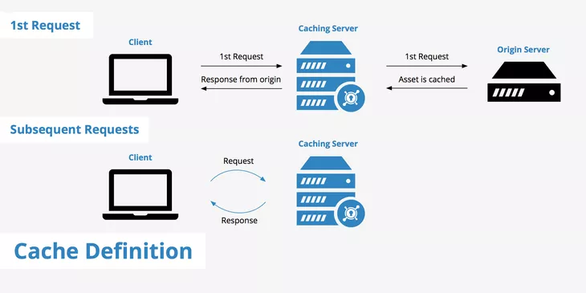

### Caching para Bases de Datos

El caching es una técnica esencial para mejorar el rendimiento y la eficiencia de las aplicaciones que utilizan bases de datos, ya sean SQL o NoSQL. Implementar una estrategia de caching adecuada puede reducir la carga en la base de datos, disminuir la latencia de las consultas y mejorar la experiencia del usuario.



#### Beneficios del Caching

- **Reducción de Latencia**: Las respuestas a consultas pueden ser más rápidas al servir datos directamente desde el caché.
- **Mejora del Rendimiento**: Disminuye la carga en la base de datos al reducir el número de consultas que deben ser procesadas.
- **Ahorro de Recursos**: Al minimizar las operaciones de lectura y escritura en la base de datos, se liberan recursos que pueden ser utilizados para otras tareas.

#### Tipos de Caching

1. **In-Memory Caching**: Almacena los resultados de las consultas en la memoria RAM para un acceso rápido. Herramientas como Redis y Memcached son comunes para este propósito.
2. **Query Result Caching**: Almacena los resultados de consultas específicas para reutilizarlos en futuras solicitudes.
3. **Application-Level Caching**: Implementación de caching en la capa de aplicación utilizando frameworks específicos del lenguaje de programación.
4. **Database-Level Caching**: Algunas bases de datos tienen capacidades integradas de caching, como el buffer cache de MySQL o el plan cache de SQL Server.

#### Estrategias de Caching

1. **Cache-Aside (Lazy Loading)**: La aplicación primero intenta leer datos del caché y, si no están presentes, los carga desde la base de datos y los almacena en el caché para futuras solicitudes.

   **Ejemplo**:
   ```java
   String data = cache.get("key");
   if (data == null) {
       data = database.get("key");
       cache.set("key", data);
   }
   return data;
   ```

2. **Write-Through**: Los datos se escriben en el caché y en la base de datos de manera síncrona.

   **Ejemplo**:
   ```java
   cache.set("key", value);
   database.set("key", value);
   ```

3. **Write-Behind (Write-Back)**: Los datos se escriben en el caché primero y luego, de manera asíncrona, se actualizan en la base de datos.

   **Ejemplo**:
   ```java
   cache.set("key", value);
   // Una tarea asíncrona actualizará la base de datos más tarde.
   ```

4. **Read-Through**: El caché se comporta como un proxy. Si los datos no están en el caché, el caché los carga desde la base de datos y los almacena.

   **Ejemplo**:
   ```java
   // La librería de caché maneja la carga y el almacenamiento automáticamente.
   String data = cache.get("key");
   return data;
   ```

#### Implementación de Caching

**Ejemplo con Redis y una Base de Datos Genérica**:

1. **Configuración de Redis**:
    - Instalar y configurar un servidor Redis.
    - Conectar la aplicación a Redis.

   **Python**:
   ```python
   import redis

   r = redis.Redis(host='localhost', port=6379, db=0)
   ```

2. **Implementación de Cache-Aside en una Aplicación de Python**:
   ```python
   def get_data_from_cache(key):
       data = r.get(key)
       if data is None:
           data = get_data_from_database(key)
           r.set(key, data)
       return data

   def get_data_from_database(key):
       # Lógica para obtener datos de la base de datos
       return data
   ```

**Ejemplo con Memcached y una Base de Datos Genérica**:

1. **Configuración de Memcached**:
    - Instalar y configurar un servidor Memcached.
    - Conectar la aplicación a Memcached.

   **Java**:
   ```java
   import net.spy.memcached.MemcachedClient;
   import java.net.InetSocketAddress;

   MemcachedClient client = new MemcachedClient(new InetSocketAddress("localhost", 11211));
   ```

2. **Implementación de Cache-Aside en una Aplicación Java**:
   ```java
   public String getDataFromCache(String key) {
       Object data = client.get(key);
       if (data == null) {
           data = getDataFromDatabase(key);
           client.set(key, 3600, data); // 3600 segundos = 1 hora
       }
       return (String) data;
   }

   public String getDataFromDatabase(String key) {
       // Lógica para obtener datos de la base de datos
       return data;
   }
   ```

### Escenarios y Consultas donde Usar Caching

El uso de caching es especialmente beneficioso en escenarios donde las consultas a la base de datos son costosas en términos de tiempo o recursos, y los datos no cambian con frecuencia.

#### Escenarios Comunes para Usar Caching

1. **Consultas Frecuentes**: Datos que se consultan repetidamente, como información de productos, perfiles de usuario, configuraciones de la aplicación, etc.
2. **Datos Ligeramente Dinámicos**: Datos que cambian ocasionalmente, como los precios de productos que se actualizan diariamente.
3. **Datos de Solo Lectura**: Datos que no se modifican una vez escritos, como archivos de registros históricos.
4. **Mejorar el Rendimiento de Reportes**: Consultas complejas para informes o análisis que pueden ser costosas en términos de recursos.
5. **Reducción de Latencia en Aplicaciones Web**: Datos críticos para la experiencia del usuario, como la página de inicio de una red social o las publicaciones más recientes.

### Ejemplo Real: Plataforma de Comercio Electrónico

Imaginemos una plataforma de comercio electrónico donde los productos se consultan frecuentemente por los usuarios. Queremos usar caching para mejorar el rendimiento de las consultas de productos.

#### Paso 1: Configuración del Caché (Redis)

**Configuración de Redis en Python**:
```python
import redis

# Conectar a Redis
r = redis.Redis(host='localhost', port=6379, db=0)
```

#### Paso 2: Implementación de Cache-Aside

Implementamos la estrategia de Cache-Aside para obtener información del producto. Si los datos no están en el caché, los obtenemos de la base de datos y los almacenamos en el caché.

**Python**:
```python
def get_product_from_cache(product_id):
    # Intenta obtener los datos del caché
    product_data = r.get(product_id)
    
    if product_data is None:
        # Si no está en el caché, obtén los datos de la base de datos
        product_data = get_product_from_database(product_id)
        
        # Almacena los datos en el caché para futuras consultas
        r.set(product_id, product_data)
    
    return product_data

def get_product_from_database(product_id):
    # Supongamos que esta función realiza una consulta a la base de datos
    # Aquí se incluye la lógica para obtener los datos de la base de datos
    product_data = {
        "id": product_id,
        "name": "Product Name",
        "price": 100,
        "description": "Product Description"
    }
    return product_data
```

#### Paso 3: Uso del Caché en la Aplicación

Cuando un usuario consulta un producto, nuestra aplicación primero intentará recuperar los datos del caché. Si los datos no están en el caché, se consultarán en la base de datos y se almacenarán en el caché para futuras solicitudes.

**Ejemplo de Consulta de Producto**:
```python
product_id = "product123"
product = get_product_from_cache(product_id)
print(product)
```

#### Paso 4: Consideraciones de Expiración y Actualización

Para manejar datos ligeramente dinámicos, es importante configurar una política de expiración en el caché y asegurarse de que el caché se actualice cuando los datos cambien.

**Configuración de Expiración en Redis**:
```python
r.set(product_id, product_data, ex=3600)  # Establece una expiración de 1 hora
```

**Actualización del Caché**:
Cuando los datos del producto se actualizan en la base de datos, también deben actualizarse en el caché.
```python
def update_product_in_database_and_cache(product_id, new_data):
    # Actualiza los datos en la base de datos
    update_product_in_database(product_id, new_data)
    
    # Actualiza los datos en el caché
    r.set(product_id, new_data, ex=3600)

def update_product_in_database(product_id, new_data):
    # Lógica para actualizar los datos en la base de datos
    pass
```
### Resumen

El caching es una técnica poderosa para mejorar el rendimiento y la escalabilidad de aplicaciones que utilizan bases de datos. Implementar estrategias de caching adecuadas, como Cache-Aside, Write-Through, Write-Behind y Read-Through, y utilizar herramientas eficientes como Redis y Memcached, puede reducir significativamente la latencia y mejorar la experiencia del usuario. Adaptar estas estrategias y herramientas según las necesidades específicas de tu aplicación y entorno te ayudará a obtener el máximo beneficio del caching.