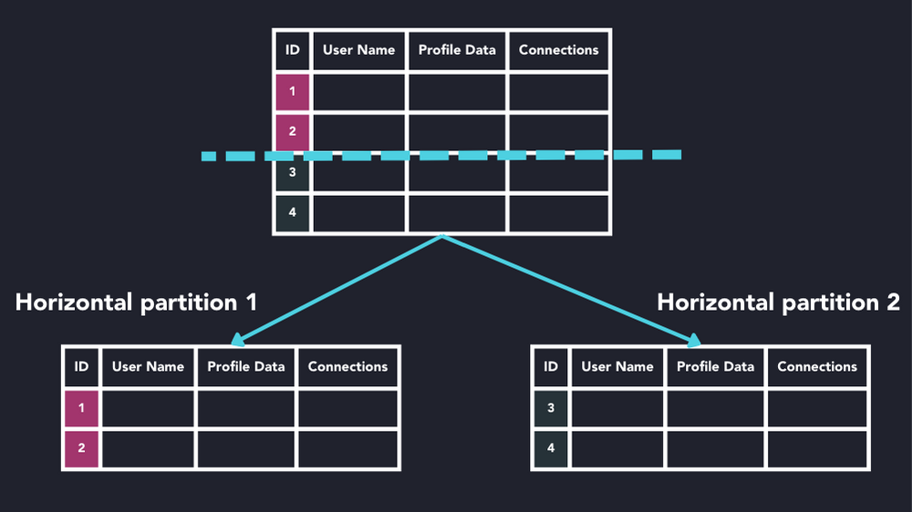
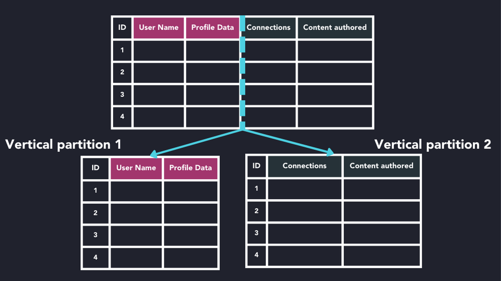
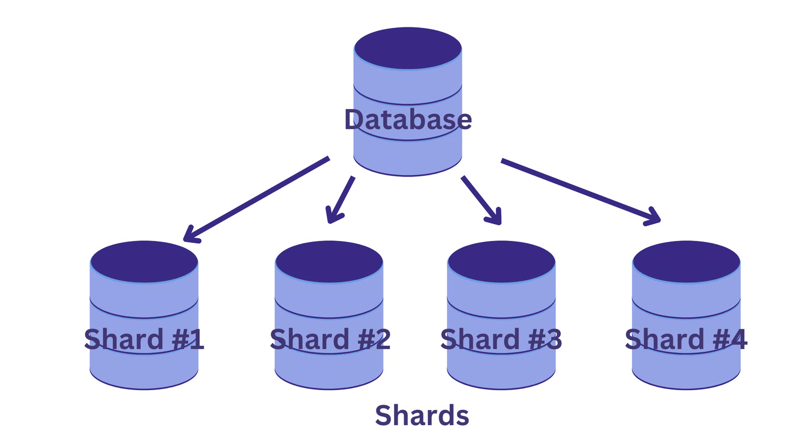

# Particionamiento y Sharding de Bases de Datos (Database Partitioning and Sharding)

**Particionamiento de bases de datos** y **Sharding** son técnicas utilizadas para mejorar el rendimiento, la escalabilidad y la manejabilidad de las bases de datos. Aunque comparten algunas similitudes, son conceptos distintos con diferentes casos de uso e implementaciones.

### Particionamiento de Bases de Datos

El **particionamiento** consiste en dividir una tabla grande de base de datos en piezas más pequeñas y manejables, manteniéndolas todas dentro de una única instancia de base de datos. Esto puede ayudar con el rendimiento, el mantenimiento y la eficiencia.

1. **Particionamiento Horizontal**: Divide las filas de una tabla en diferentes particiones. Por ejemplo, una tabla de usuarios podría ser particionada por rangos de IDs de usuario.

#### Particionamiento Horizontal

El particionamiento horizontal divide una tabla en múltiples tablas que contienen el mismo número de columnas, pero menos filas. Por ejemplo, si una tabla contiene un gran número de filas que representan informes mensuales, podría particionarse horizontalmente en tablas por años, con cada tabla representando todos los informes mensuales de un año específico. De esta manera, las consultas que requieren datos de un año específico solo referenciarán la tabla apropiada. Las tablas deben particionarse de manera que las consultas referencien el menor número de tablas posible.



#### Ejemplo de Particionamiento Horizontal

Imaginemos una tabla `MonthlyReports` que contiene datos de informes mensuales:

```sql
CREATE TABLE MonthlyReports (
    ReportID INT,
    ReportMonth DATE,
    ReportData TEXT
);
```

Si esta tabla contiene informes desde 2010 hasta 2024, podemos particionarla horizontalmente en tablas por año:

```sql
CREATE TABLE MonthlyReports_2010 (
    ReportID INT,
    ReportMonth DATE,
    ReportData TEXT
);

CREATE TABLE MonthlyReports_2011 (
    ReportID INT,
    ReportMonth DATE,
    ReportData TEXT
);

-- Continuar creando tablas para cada año
```

### Ventajas del Particionamiento Horizontal

- **Mejora del Rendimiento**: Las consultas que solo necesitan datos de un año específico pueden ejecutarse más rápido porque solo acceden a una tabla particionada más pequeña en lugar de una tabla completa grande.
- **Mantenimiento Simplificado**: Las operaciones de mantenimiento, como la copia de seguridad y la restauración, pueden ser más rápidas y manejables al trabajar con tablas más pequeñas.
- **Escalabilidad**: Permite gestionar el crecimiento de los datos de manera más eficiente al dividir los datos en particiones más pequeñas y manejables.

### Ejemplo de Consulta Optimizada

Supongamos que queremos consultar todos los informes del año 2020. Con el particionamiento horizontal, la consulta se dirigirá únicamente a la tabla correspondiente a ese año:

```sql
SELECT ReportID, ReportMonth, ReportData
FROM MonthlyReports_2020
WHERE ReportMonth BETWEEN '2020-01-01' AND '2020-12-31';
```

Esta consulta es más eficiente porque solo escanea la tabla `MonthlyReports_2020`, evitando el escaneo de una tabla mucho más grande que contendría datos de múltiples años.

En resumen, el particionamiento horizontal es una técnica efectiva para manejar grandes volúmenes de datos en bases de datos, mejorando el rendimiento de las consultas y facilitando el mantenimiento y la escalabilidad.

2. **Particionamiento Vertical**: Divide las columnas de una tabla en diferentes particiones. Por ejemplo, una tabla con mucha información podría dividirse en una partición con datos de usuario y otra con datos de transacciones.

#### Un ejemplo de particionamiento vertical

Un ejemplo de particionamiento vertical puede ser una tabla grande con informes para empleados que contiene información básica, como el nombre del informe, el ID, el número de informe y una columna grande con la descripción del informe. Suponiendo que aproximadamente el 95% de los usuarios están buscando en la parte del nombre del informe, número, etc., y que solo aproximadamente el 5% de las solicitudes están abriendo el campo de descripción del informe y mirando la descripción. Supongamos que todas esas búsquedas llevarán a escaneos del índice agrupado y, dado que el escaneo del índice lee todas las filas en la tabla, el costo de la consulta es proporcional al número total de filas en la tabla y nuestro objetivo es minimizar el número de operaciones de E/S y reducir el costo de la búsqueda.



Veamos el ejemplo en la tabla `EmployeeReports`:

- **Tabla original: `EmployeeReports`**
    - Columnas: `ReportID`, `ReportName`, `ReportNumber`, `ReportDescription`

Para mejorar el rendimiento, podemos dividir la tabla de la siguiente manera:

- **Tabla 1: `EmployeeReportsBasic`**
    - Columnas: `ReportID`, `ReportName`, `ReportNumber`
- **Tabla 2: `EmployeeReportsDescriptions`**
    - Columnas: `ReportID`, `ReportDescription`

Al hacer esto, las consultas que buscan información básica del informe solo necesitan escanear la tabla `EmployeeReportsBasic`, que es más pequeña y, por lo tanto, más rápida de escanear. Solo cuando se necesita la descripción del informe, se accede a la tabla `EmployeeReportsDescriptions`, reduciendo así el número de operaciones de E/S y el costo de las búsquedas en la mayoría de los casos.

#### Beneficios del Particionamiento
- **Mejora del Rendimiento**: Las consultas pueden ejecutarse más rápido al operar solo en la partición relevante.
- **Mantenimiento Simplificado**: Las tareas de mantenimiento, como la copia de seguridad y la recuperación, pueden ser más rápidas y fáciles de manejar.
- **Distribución de la Carga**: Puede ayudar a distribuir la carga de trabajo en diferentes discos físicos.

## Sharding

El **Sharding** es una forma de particionamiento horizontal que distribuye los datos en múltiples instancias de base de datos, cada una con su propio conjunto de datos. Cada instancia se denomina "shard" y actúa como una base de datos completa y autónoma.



##### Beneficios del Sharding
- **Escalabilidad Horizontal**: Permite añadir más servidores para manejar la creciente carga de trabajo.
- **Alta Disponibilidad**: La falla de un shard no afecta a los demás, lo que mejora la disponibilidad.
- **Distribución de la Carga**: La carga de trabajo se distribuye entre múltiples servidores, mejorando el rendimiento.

##### Desafíos del Sharding
- **Complejidad de Gestión**: Manejar múltiples instancias de base de datos puede ser complejo.
- **Repartición de Shards**: Requiere reequilibrar los datos cuando se añaden o eliminan shards, lo que puede ser complicado.
- **Consultas Transversales**: Las consultas que necesitan acceder a múltiples shards pueden ser menos eficientes y más complejas de implementar.

#### Ejemplo de Uso

- **Particionamiento**: Una empresa con una gran cantidad de datos históricos puede particionar su tabla de transacciones por año para mejorar el rendimiento de las consultas y facilitar el mantenimiento.
- **Sharding**: Una aplicación web de gran escala como una red social puede utilizar sharding para distribuir los datos de usuarios en múltiples servidores, asegurando que el sistema sea escalable y mantenga un rendimiento óptimo.

Ambas técnicas son fundamentales para manejar grandes volúmenes de datos y mejorar la eficiencia de las bases de datos en sistemas de producción. Elegir entre particionamiento y sharding dependerá de los requisitos específicos del proyecto y la infraestructura existente.

