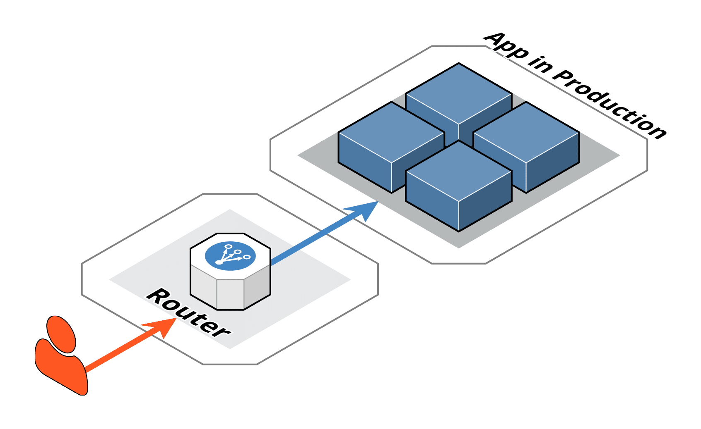
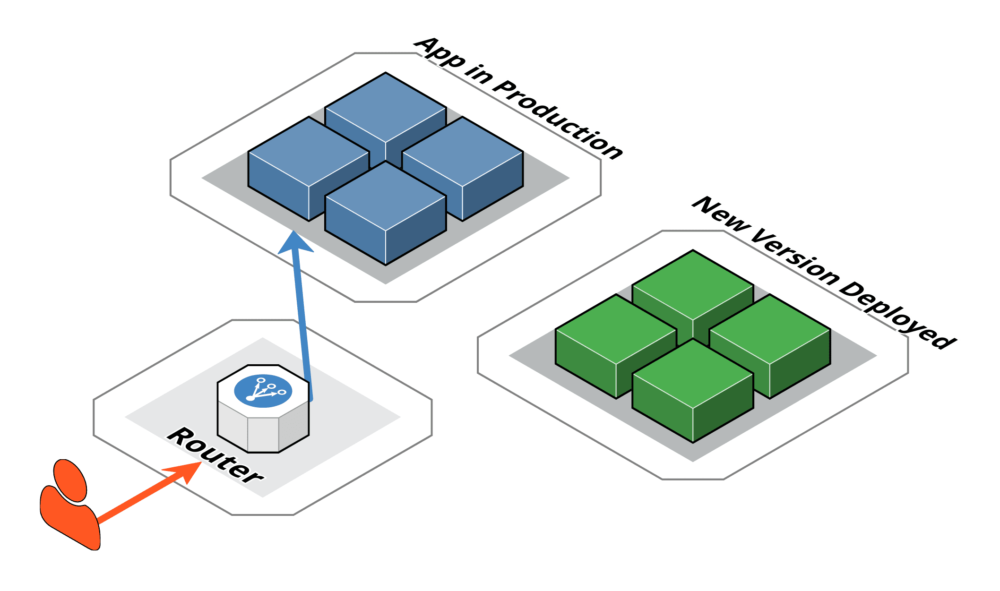
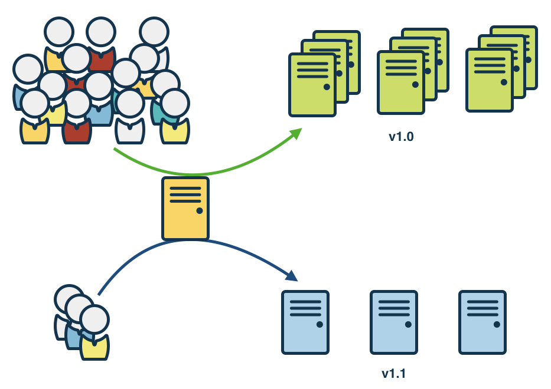
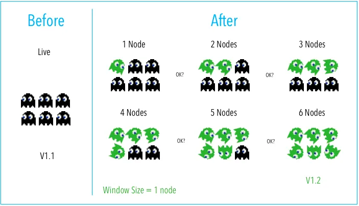

# Docker in CI/CD Pipelines

### Docker en Pipelines de CI/CD

Docker juega un papel fundamental en la integración continua (CI) y el despliegue continuo (CD) al proporcionar un entorno coherente y reproducible para construir, probar y desplegar aplicaciones. Aquí se detalla cómo Docker se integra en los pipelines de CI/CD:

#### 1. **Construcción de Imágenes Docker en CI**
En un pipeline de CI, Docker se utiliza para construir imágenes de contenedores a partir del código fuente y Dockerfiles. Estas imágenes luego se pueden usar para pruebas y despliegues. Un ejemplo utilizando Jenkins:

```groovy
pipeline {
    agent any
    stages {
        stage('Build') {
            steps {
                script {
                    docker.build('my-app:latest')
                }
            }
        }
        stage('Test') {
            steps {
                script {
                    docker.image('my-app:latest').inside {
                        sh 'npm test'
                    }
                }
            }
        }
        stage('Push') {
            steps {
                script {
                    docker.withRegistry('https://registry.hub.docker.com', 'dockerhub-credentials') {
                        docker.image('my-app:latest').push()
                    }
                }
            }
        }
    }
}
```

En este ejemplo de Jenkinsfile:
- La etapa `Build` construye la imagen Docker.
- La etapa `Test` ejecuta pruebas dentro de un contenedor.
- La etapa `Push` sube la imagen a Docker Hub.

#### 2. **Pruebas en Contenedores**
Las pruebas en contenedores Docker aseguran que el código se ejecutará de manera consistente en cualquier entorno. Esto es especialmente útil para pruebas de integración y pruebas de extremo a extremo. Un ejemplo de cómo podrías ejecutar pruebas utilizando Docker Compose:

```yaml
version: '3.8'
services:
  app:
    build: .
    command: npm test
  db:
    image: postgres:13
    environment:
      POSTGRES_USER: example
      POSTGRES_PASSWORD: example
```

Ejecuta las pruebas con Docker Compose:

```bash
docker-compose up --abort-on-container-exit
```

#### 3. **Despliegue Continuo (CD)**
Docker facilita el despliegue continuo al permitir que las imágenes construidas y probadas se desplieguen fácilmente en cualquier entorno que soporte Docker, como Kubernetes, AWS ECS, Azure ACI, etc. Un ejemplo de despliegue a un clúster de Kubernetes utilizando Jenkins:

```groovy
pipeline {
    agent any
    stages {
        stage('Deploy') {
            steps {
                script {
                    kubernetesDeploy(
                        configs: 'k8s/deployment.yaml',
                        kubeconfigId: 'kubeconfig'
                    )
                }
            }
        }
    }
}
```

#### 4. **Integración con Herramientas de CI/CD**
Docker se integra con diversas herramientas de CI/CD, como Jenkins, GitLab CI, CircleCI, Travis CI, entre otras. Estas herramientas proporcionan plugins y soporte nativo para trabajar con Docker, lo que facilita la creación de pipelines robustos y eficientes.

### Ejemplo Completo: Pipeline de CI/CD con GitLab CI y Docker
Aquí tienes un ejemplo de cómo configurar un pipeline de CI/CD completo con GitLab CI:

```yaml
stages:
  - build
  - test
  - deploy

build:
  stage: build
  script:
    - docker build -t my-app:latest .
    - docker login -u $CI_REGISTRY_USER -p $CI_REGISTRY_PASSWORD $CI_REGISTRY
    - docker push my-app:latest

test:
  stage: test
  script:
    - docker run my-app:latest npm test

deploy:
  stage: deploy
  script:
    - docker login -u $CI_REGISTRY_USER -p $CI_REGISTRY_PASSWORD $CI_REGISTRY
    - docker pull my-app:latest
    - docker tag my-app:latest my-registry/my-app:latest
    - docker push my-registry/my-app:latest
    - kubectl apply -f k8s/deployment.yaml
```

## Despliegue con Docker

El despliegue de aplicaciones con Docker implica la creación de contenedores a partir de imágenes y la ejecución de estos contenedores en diferentes entornos. Docker facilita la portabilidad y la consistencia en el despliegue, permitiendo que las aplicaciones se ejecuten de la misma manera en cualquier lugar. A continuación, se describe cómo realizar despliegues con Docker.

### 1. **Despliegue Local**
Para desplegar una aplicación en tu máquina local usando Docker, sigue estos pasos:

1. **Construir la imagen Docker**:
   ```bash
   docker build -t my-app:latest .
   ```

2. **Ejecutar el contenedor**:
   ```bash
   docker run -d -p 80:80 my-app:latest
   ```

    - `-d` ejecuta el contenedor en modo separado.
    - `-p 80:80` mapea el puerto 80 del host al puerto 80 del contenedor.

### 2. **Despliegue en un Servidor Remoto**
Para desplegar en un servidor remoto, necesitas tener acceso SSH al servidor. Aquí tienes un ejemplo de cómo podrías hacerlo:

1. **Construir la imagen Docker**:
   ```bash
   docker build -t my-app:latest .
   ```

2. **Subir la imagen a un registro (Docker Hub, ACR, ECR, GCR)**:
   ```bash
   docker login -u <usuario> -p <contraseña>
   docker tag my-app:latest <usuario>/my-app:latest
   docker push <usuario>/my-app:latest
   ```

3. **Ejecutar la imagen en el servidor remoto**:
   ```bash
   ssh user@remote-server "docker pull <usuario>/my-app:latest && docker run -d -p 80:80 <usuario>/my-app:latest"
   ```

### 3. **Despliegue en la Nube**
Docker se integra bien con varios proveedores de nube, como AWS, Azure y Google Cloud. Aquí tienes ejemplos de despliegue en estos servicios.

### AWS Elastic Container Service (ECS)
1. **Definir una tarea ECS** en la consola de administración de AWS que especifique la imagen Docker y sus configuraciones.
2. **Crear un clúster ECS** y agregar la tarea definida.
3. **Desplegar la tarea** utilizando el clúster ECS.

#### Azure Container Instances (ACI)
1. **Subir la imagen a Azure Container Registry (ACR)**:
   ```bash
   az acr login --name <nombre_registro>
   docker tag my-app:latest <nombre_registro>.azurecr.io/my-app:latest
   docker push <nombre_registro>.azurecr.io/my-app:latest
   ```

2. **Crear una instancia de contenedor en Azure**:
   ```bash
   az container create --resource-group myResourceGroup --name myApp --image <nombre_registro>.azurecr.io/my-app:latest --cpu 1 --memory 1 --registry-login-server <nombre_registro>.azurecr.io --registry-username <usuario> --registry-password <contraseña> --ports 80
   ```

### Google Kubernetes Engine (GKE)
1. **Subir la imagen a Google Container Registry (GCR)**:
   ```bash
   docker tag my-app:latest gcr.io/<project-id>/my-app:latest
   docker push gcr.io/<project-id>/my-app:latest
   ```

2. **Crear un clúster GKE**:
   ```bash
   gcloud container clusters create my-cluster --num-nodes=3
   ```

3. **Desplegar la aplicación en GKE**:
   ```bash
   kubectl run my-app --image=gcr.io/<project-id>/my-app:latest --port=80
   kubectl expose deployment my-app --type=LoadBalancer --port 80 --target-port 80
   ```

### 4. **Despliegue con Docker Compose**
Para aplicaciones multi-contenedor, Docker Compose facilita el despliegue. Aquí tienes un ejemplo de un archivo `docker-compose.yml` y cómo desplegarlo:

```yaml
version: '3.8'
services:
  web:
    image: my-app:latest
    ports:
      - "80:80"
  db:
    image: postgres:13
    environment:
      POSTGRES_USER: example
      POSTGRES_PASSWORD: example
```

Para desplegar la aplicación:
```bash
docker-compose up -d
```

## Una introducción a Kubernetes
Kubernetes se deriva de la palabra griega κυβερνήτης (kubernḗtēs), que significa piloto o timonel. El logo de Kubernetes, que es un timón de barco, refuerza aún más la idea de pilotar o gestionar, que es exactamente lo que Kubernetes hace con los contenedores de Docker. Kubernetes gestiona los contenedores de Docker de diversas maneras para que no tenga que hacerse manualmente. A menudo, se hace referencia a Kubernetes como K8s por simplicidad debido a las 8 letras entre la "K" y la "s". A partir de ahora, me referiré a Kubernetes como K8s.

d
El uso de K8s abstrae aún más las máquinas, el almacenamiento y las redes de su implementación física. Gestionar manualmente numerosos contenedores puede crear problemas similares a los de gestionar máquinas virtuales. Sin embargo, la gestión de contenedores es especialmente importante porque las compañías de la nube te cobran por cosas como el tiempo de cómputo y el almacenamiento. No deseas tener muchos contenedores en ejecución sin hacer nada por esta razón. Además, tampoco deseas que un contenedor maneje una carga de red que no pueda gestionar por sí mismo. K8s está diseñado para resolver problemas como estos.

¿Qué servicios proporciona K8s?
- **Descubrimiento de servicios y balanceo de carga:** K8s puede localizar un contenedor utilizando un nombre DNS o una dirección IP y puede distribuir el tráfico de red a otros contenedores para estabilizar los despliegues.
- **Orquestación de almacenamiento:** Puedes montar automáticamente un sistema de almacenamiento de tu elección, ya sea localmente, con un proveedor de nube como AWS o GCP, o un sistema de almacenamiento en red como NFS, iSCSI, Gluster, Ceph, Cinder o Flocker.
- **Despliegues y retrocesos automatizados:** Puedes definir el estado deseado de los contenedores desplegados y cambiar el estado a un ritmo controlado. Por ejemplo, puedes automatizar Kubernetes para crear nuevos contenedores para tu despliegue, eliminar contenedores existentes y adoptar todos sus recursos en el nuevo contenedor.
- **Empaquetado automático:** Puedes proporcionar a K8s un clúster de nodos para ejecutar tareas contenedorizadas y especificar cuánta CPU y memoria necesita cada contenedor. Kubernetes puede ajustar automáticamente los contenedores en los nodos para hacer el mejor uso de los recursos.
- **Autocuración:** K8s reinicia contenedores que fallan, reemplaza contenedores, mata contenedores que no responden a tu verificación de salud definida por el usuario y no los anuncia a los clientes hasta que estén listos para servir.
- **Gestión de secretos y configuración:** K8s te permite almacenar información sensible como claves SSH, tokens OAuth y contraseñas. Puedes actualizar estos secretos y la configuración de la aplicación sin reconstruir las imágenes de tus contenedores y sin exponer secretos en la configuración de tu stack.

### Estrategias Avanzadas para Desplegar Contenedores Docker

Al desplegar contenedores Docker en producción, se pueden utilizar varias estrategias avanzadas para minimizar el tiempo de inactividad, reducir riesgos y asegurar un despliegue suave. Entre estas estrategias se encuentran el despliegue azul-verde, el despliegue canario, el despliegue gradual (rolling deployment) y las pruebas A/B. A continuación se describen estas estrategias:

### 1. **Despliegue Azul-Verde (Blue-Green Deployment)**
El despliegue azul-verde implica tener dos entornos de producción idénticos: uno activo (azul) y uno en espera (verde).

1. **Preparación del Entorno Verde**: Se despliega la nueva versión de la aplicación en el entorno verde mientras el entorno azul sigue manejando el tráfico de producción.
2. **Pruebas del Entorno Verde**: Se realizan pruebas exhaustivas en el entorno verde para asegurar que la nueva versión funciona correctamente.
3. **Cambio de Tráfico**: Si las pruebas son exitosas, el tráfico de producción se redirige del entorno azul al verde.



Cuando queremos instalar una nueva version, GREEN, creamos un nuevo ambiente y desplegamos la aplicacion


Despues de probar y asegurarnos de que el ambiente verde funciona adecuadamente se redirige trafico a la nueva version


### Desmantelamiento del Entorno Azul 
El entorno azul se mantiene como respaldo o se prepara para la próxima actualización.


**Ventajas**:
- Minimiza el tiempo de inactividad.
- Facilita la reversión rápida en caso de problemas.

**Desventajas**:
- Requiere el doble de recursos durante el despliegue.

#### 2. **Despliegue Canario (Canary Deployment)**
El despliegue canario implica desplegar la nueva versión de la aplicación a un subconjunto pequeño de usuarios antes de hacer el despliegue completo.

1. **Despliegue Inicial**: Despliega la nueva versión a un pequeño grupo de servidores (canarios).
2. **Monitoreo**: Monitorea de cerca el rendimiento y los errores en los servidores canarios.
3. **Despliegue Completo**: Si no se detectan problemas, despliega gradualmente la nueva versión al resto de los servidores.




**Ventajas**:
- Detecta problemas en una pequeña porción del tráfico antes de un despliegue completo.
- Reduce el riesgo asociado con los nuevos despliegues.

**Desventajas**:
- Puede ser complicado de configurar y monitorear.

#### 3. **Despliegue Gradual (Rolling Deployment)**
El despliegue gradual implica actualizar los servidores uno a uno o en pequeños grupos, minimizando el impacto en los usuarios.

1. **Actualización de Servidores**: Actualiza un servidor a la vez con la nueva versión mientras el resto de los servidores siguen ejecutando la versión anterior.
2. **Monitoreo**: Monitorea el rendimiento y los errores a medida que se actualizan los servidores.
3. **Continuar el Proceso**: Continúa actualizando los servidores hasta que todos estén ejecutando la nueva versión.




**Ventajas**:
- Minimiza el tiempo de inactividad.
- Permite detectar problemas rápidamente y revertir si es necesario.

**Desventajas**:
- Requiere una infraestructura que soporte actualizaciones continuas.

