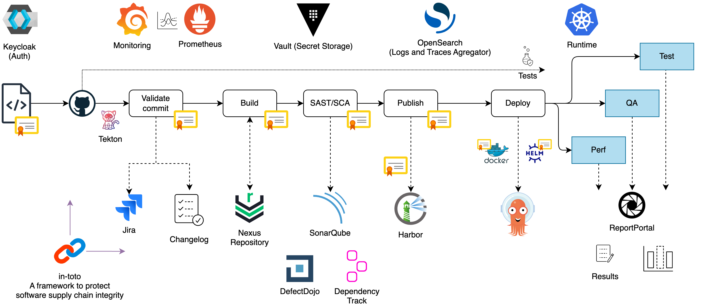

# Containers y Docker
## CI/CD

## Usa contenedores para Construir, Compartir y Ejecutar tus aplicaciones

Durante el envío, las mercancías se transportan utilizando diferentes tipos de transporte: camiones, grúas, montacargas, trenes, barcos, etc. Además, las mercancías vienen en diferentes tamaños y formas y tienen diferentes requisitos de transporte. Históricamente, este era un proceso costoso y engorroso que a menudo requería mucho trabajo manual para mover los artículos dentro y fuera de los lugares en cada punto de tránsito. Los trabajadores que realizaban ese trabajo se llamaban estibadores (dockers).


Aquellos que trabajan en TI pueden relacionarse con esta metáfora de los contenedores de envío. Atrás quedaron los días en que una aplicación web se desarrollaba utilizando STACK LAMP (Linux, Apache, MySQL y PHP) común. Hoy en día, los sistemas pueden incluir componentes diversos, desde frameworks de JavaScript y bases de datos NoSQL hasta APIs REST y servicios backend, todos escritos en diferentes lenguajes de programación. Además, este software puede ejecutarse parcial o completamente en diferentes hardware, desde la computadora de un desarrollador hasta un proveedor de nube en producción. Estos son diferentes entornos que utilizan diferentes sistemas operativos con diferentes requisitos.

Docker es una plataforma para desarrollar y desplegar aplicaciones en contenedores ligeros. Así como los contenedores intermodales simplificaron el transporte de mercancías, Docker facilitó el empaquetado y envío de diferentes programas en el mismo host o clúster mientras los mantiene aislados.

## ¿Qué es Docker?
Docker es una plataforma de software de contenedorización de código abierto: se utiliza para crear, desplegar y gestionar aplicaciones en contenedores virtualizados. Con la ayuda de Docker, las aplicaciones, incluyendo su entorno, pueden ser proporcionadas en paralelo y aisladas unas de otras en un sistema host.

Lanzada en 2013 como un proyecto de código abierto, la tecnología Docker hizo uso de conceptos informáticos existentes en torno a los contenedores, específicamente el kernel de Linux con sus características.

Después del éxito con Linux, Docker se asoció con Microsoft para llevar los contenedores y su funcionalidad a Windows Server. Ahora, el software también está disponible para macOS.

El corazón y alma de Docker son los contenedores: paquetes de software virtuales ligeros que combinan el código fuente de la aplicación con todas las dependencias, como bibliotecas del sistema (libs) y archivos binarios, así como paquetes externos, frameworks, modelos de aprendizaje automático y más. Con Docker, las aplicaciones y sus entornos son virtualizados y aislados entre sí en un sistema operativo compartido del equipo host.


### El motor de Docker
El motor de Docker actúa como una interfaz entre la aplicación en contenedor y el sistema operativo host. Asigna los recursos del sistema operativo a los contenedores y asegura que los contenedores estén aislados entre sí.

Los entornos de contenedores pueden operar en computadoras locales en las instalaciones o ser proporcionados a través de nubes privadas y públicas. Soluciones como Kubernetes se utilizan para orquestar entornos de contenedores. Aunque seguramente has visto la comparación Docker vs Kubernetes, estos dos sistemas no pueden ser comparados directamente. Docker es responsable de crear contenedores y Kubernetes los gestiona a gran escala.

### Contenedores Docker vs máquinas virtuales
Las máquinas virtuales y los contenedores son los dos conceptos clave de la virtualización que deben distinguirse claramente entre sí.


### Máquina virtual (VM) vs Contenedores Docker

Una máquina virtual (VM) es una computadora virtualizada que consta de tres capas: el sistema operativo invitado, los binarios y bibliotecas, y finalmente la aplicación que se ejecuta en la máquina. Una VM se basa en un hipervisor como KVM o Xen que actúa como la interfaz entre un sistema operativo host y la máquina virtual.

Con este software, toda la máquina física (CPU, RAM, unidades de disco, redes virtuales, periféricos, etc.) se emula. Por lo tanto, el sistema operativo invitado se puede instalar en este hardware virtual, y desde allí, las aplicaciones se pueden instalar y ejecutar de la misma manera que en el sistema operativo host.

Los contenedores, por otro lado, usan el mismo sistema operativo del ordenador host subyacente. No se virtualiza el hardware. Solo los entornos de ejecución con las bibliotecas de programas y configuraciones, así como las aplicaciones, incluidos sus datos, son virtualizados. Un motor de contenedores actúa como una interfaz entre los contenedores y el sistema operativo host y asigna los recursos necesarios.

Los contenedores requieren menos recursos del host, como potencia de procesamiento, RAM y espacio de almacenamiento, que las máquinas virtuales. Un contenedor se inicia más rápido que una máquina virtual porque no es necesario arrancar un sistema operativo completo.

### Casos de uso comunes de Docker
Hay muy pocos límites para los posibles usos de la virtualización de contenedores con Docker. Las áreas típicas de aplicación de Docker son:

- Entrega de aplicaciones basadas en microservicios y nativas de la nube.
- Procesos estandarizados de integración y entrega continua (CI/CD) para aplicaciones.
- Aislamiento de múltiples aplicaciones paralelas en un sistema host.
- Desarrollo de aplicaciones más rápido.
- Migración de software.
- Escalado de entornos de aplicaciones.

### ¿Cómo funciona Docker?

### Componentes principales de la arquitectura de Docker
Para entender cómo usar Docker y sus características de manera más efectiva, es necesario tener al menos una idea general de cómo se organiza el trabajo conjunto de los componentes de la plataforma ocultos al usuario.


### Arquitectura de Docker

Docker utiliza una arquitectura cliente-servidor donde el cliente de Docker se comunica con el daemon de Docker a través de una API RESTful, sockets UNIX o una interfaz de red.

#### Daemon de Docker
El daemon de Docker es un servidor con un proceso en segundo plano persistente que gestiona todos los objetos Docker (los veremos a continuación). Constantemente escucha y procesa las solicitudes de la API de Docker. El daemon de Docker es un servicio que se ejecuta en tu sistema operativo host.

El daemon de Docker utiliza un "controlador de ejecución" para crear contenedores. Por defecto, este es el controlador runC propio de Docker, pero también hay soporte para contenedores Linux (LXC). RunC está muy estrechamente ligado a las siguientes características del kernel de Linux, a saber:

- **cgroups**: se utilizan para gestionar los recursos consumidos por un contenedor (por ejemplo, uso de CPU y memoria) y en la funcionalidad de pausa de Docker.
- **namespaces**: son responsables de aislar los contenedores y asegurarse de que el sistema de archivos, nombre de host, usuarios, red y procesos de un contenedor estén separados del resto del sistema.


#### Cliente de Docker
El cliente de Docker es una Interfaz de Línea de Comandos (CLI) que puedes usar para emitir comandos a un daemon de Docker para construir, ejecutar y detener aplicaciones. El cliente puede residir en el mismo host que el daemon o conectarse a él en un host remoto y comunicarse con más de un daemon.

El propósito principal del cliente de Docker es proporcionar un medio por el cual las imágenes de Docker (archivos utilizados para crear contenedores Docker) pueden ser descargadas de un registro y ejecutadas en un host de Docker. Los comandos comunes emitidos por un cliente son:

- `docker build`
- `docker pull`
- `docker run`

#### API del Motor de Docker
La API del Motor de Docker es una API RESTful utilizada por las aplicaciones para interactuar con el daemon de Docker. Puede ser accesada por un cliente HTTP o la biblioteca HTTP que es parte de la mayoría de los lenguajes de programación modernos.

La API utilizada para la comunicación con el daemon está bien definida y documentada, lo que permite a los desarrolladores escribir programas que interfacen directamente con el daemon sin usar el cliente de Docker.

#### Registros de Docker
Los registros de Docker son repositorios para almacenar y distribuir imágenes de Docker. Por defecto, es un registro público llamado Docker Hub. Aloja miles de imágenes públicas, así como imágenes "oficiales" gestionadas.

También puedes ejecutar tu propio registro privado para almacenar imágenes comerciales y propietarias y eliminar la sobrecarga asociada con la descarga de imágenes desde Internet.

El daemon de Docker descarga imágenes de los registros usando la solicitud `docker pull`. También descarga automáticamente las imágenes especificadas en la solicitud `docker run` y dentro de la instrucción `FROM` del Dockerfile si esas imágenes no están disponibles en el sistema local.

### Dockerfile
El Dockerfile es un archivo de texto con instrucciones que se utilizan para crear una imagen de Docker. Define todo lo necesario para construir una imagen, incluyendo el sistema operativo base, las dependencias de software, los archivos de configuración y los comandos que deben ejecutarse dentro del contenedor.

#### Imágenes de Docker
Las imágenes de Docker son plantillas de solo lectura utilizadas para crear contenedores. Una imagen incluye todo lo necesario para ejecutar una aplicación: código, bibliotecas, dependencias, herramientas y configuraciones del sistema. Las imágenes se crean a partir de un Dockerfile.

#### Contenedores de Docker
Los contenedores de Docker son instancias ejecutables de imágenes de Docker. Son unidades ligeras y autónomas que empaquetan el código de la aplicación con todas sus dependencias. Los contenedores se ejecutan en el motor de Docker y están aislados entre sí y del sistema operativo host.


### Dockerfile
El Dockerfile es un archivo simple basado en texto que contiene comandos e instrucciones mediante los cuales puedes crear una nueva imagen de Docker y pasarla a un servidor.

```dockerfile
# syntax=docker/dockerfile:1

FROM node:18-alpine
WORKDIR /app
COPY . .
RUN yarn install --production
CMD ["node", "src/index.js"]
EXPOSE 3000
```

## Docker Hub y Otros Registros

### Docker Hub
Docker Hub es el registro público predeterminado para almacenar y distribuir imágenes de Docker. Aloja miles de imágenes públicas que los usuarios pueden descargar y usar, así como imágenes "oficiales" gestionadas por Docker y otros proveedores. Docker Hub permite a los desarrolladores compartir y acceder a imágenes de contenedores de manera fácil y eficiente.

### Otros Registros
Además de Docker Hub, existen otros registros donde se pueden almacenar y distribuir imágenes de Docker. Algunos ejemplos incluyen:

- **Azure Container Registry (ACR):** Un registro privado ofrecido por Microsoft Azure, que permite a las empresas almacenar y gestionar sus imágenes de contenedores en la nube de Azure.
- **Amazon Elastic Container Registry (ECR):** Un servicio de registro de contenedores de AWS que facilita el almacenamiento y la gestión de imágenes de contenedores en AWS.
- **Google Container Registry (GCR):** Un servicio de registro de contenedores de Google Cloud que permite almacenar y gestionar imágenes de contenedores en la nube de Google.
- **Registros privados:** Las organizaciones también pueden configurar y operar sus propios registros privados para almacenar imágenes de Docker comerciales y propietarias, lo que puede proporcionar mayor seguridad y control sobre el acceso a las imágenes.

Los registros de Docker permiten la gestión centralizada de imágenes de contenedores, facilitando la distribución y el despliegue de aplicaciones en diferentes entornos y plataformas.

## El Papel de Docker en el Desarrollo

Docker juega un papel crucial en el desarrollo de software moderno al proporcionar una plataforma que facilita la creación, despliegue y gestión de aplicaciones de manera eficiente y consistente. Aquí se describen algunos de los roles más importantes de Docker en el desarrollo:

### 1. **Consistencia en los Entornos de Desarrollo**
Docker permite a los desarrolladores crear entornos de desarrollo que son consistentes en todos los equipos. Al empaquetar una aplicación y sus dependencias en contenedores, Docker garantiza que la aplicación se ejecutará de la misma manera en cualquier entorno, eliminando los problemas que surgen de las diferencias en las configuraciones de los sistemas operativos y las bibliotecas.

### 2. **Facilitación del Desarrollo de Microservicios**
Docker es ideal para el desarrollo de aplicaciones basadas en microservicios. Cada microservicio puede ser empaquetado en su propio contenedor, lo que permite a los equipos desarrollar, probar y desplegar microservicios de manera independiente. Esto mejora la modularidad y la escalabilidad de las aplicaciones.

### 3. **Integración Continua y Despliegue Continuo (CI/CD)**
Docker se integra perfectamente con las herramientas de CI/CD, como Jenkins, GitLab CI, y CircleCI. Los contenedores Docker pueden ser construidos, probados y desplegados automáticamente como parte de un pipeline de CI/CD, lo que acelera el ciclo de desarrollo y garantiza que el código siempre esté en un estado desplegable.

### 4. **Entornos de Prueba Aislados**
Los contenedores Docker proporcionan entornos aislados para pruebas. Esto significa que los desarrolladores pueden ejecutar múltiples instancias de una aplicación en diferentes configuraciones simultáneamente, sin interferencias. Esto facilita la realización de pruebas unitarias, de integración y de rendimiento.

### 5. **Facilitación de la Colaboración**
Docker simplifica la colaboración entre desarrolladores al permitirles compartir entornos de desarrollo y configuraciones a través de imágenes de contenedores. Las imágenes pueden ser compartidas fácilmente a través de Docker Hub u otros registros privados, lo que facilita la configuración rápida de entornos de desarrollo idénticos.

### 6. **Despliegue en la Nube**
Docker permite un despliegue sencillo en la nube. Los contenedores Docker pueden ser desplegados en cualquier proveedor de nube que soporte contenedores, como AWS, Azure, Google Cloud, y otros. Esto proporciona flexibilidad y escalabilidad, permitiendo a las aplicaciones crecer según sea necesario.

### 7. **Optimización de Recursos**
Los contenedores Docker son ligeros y eficientes en el uso de recursos. A diferencia de las máquinas virtuales, que requieren un sistema operativo completo para cada instancia, los contenedores comparten el núcleo del sistema operativo del host, lo que reduce significativamente el uso de CPU, memoria y almacenamiento.

## Alternativas a Docker

Aunque Docker es único en su clase, existen varias alternativas de contenedores que pueden merecer tu atención.

### LXD (Linux Container Daemon)
LXD, el "Daemon de Contenedores de Linux", es una herramienta de gestión para contenedores del sistema operativo Linux, desarrollada por Canonical, la compañía detrás de Ubuntu Linux. Con LXD, los contenedores del sistema operativo Linux pueden ser configurados y controlados a través de un conjunto definido de comandos. LXD es adecuado para automatizar la gestión masiva de contenedores y se utiliza en la computación en la nube y centros de datos. LXD permite la virtualización de un sistema operativo Linux completo sobre la base de contenedores. Como tal, la tecnología combina la conveniencia de las máquinas virtuales con el rendimiento de los contenedores.

### Podman
Podman es una herramienta de gestión de contenedores de código abierto para desarrollar, gestionar y ejecutar contenedores OCI (Open Container Initiative). OCI fue introducido por Docker Inc. en 2015 y describe dos especificaciones: la especificación de tiempo de ejecución y la especificación de imagen.

Cualquier software puede implementar las especificaciones, creando imágenes de contenedores y tiempos de ejecución de contenedores compatibles entre sí. Además, existen las llamadas Interfaces de Tiempo de Ejecución de Contenedores (CRI), que se basan en los tiempos de ejecución de OCI y los abstraen.

A diferencia de Docker, Podman no es un tiempo de ejecución de contenedores, sino una implementación de la especificación de imagen OCI. En consecuencia, Podman por sí mismo no puede iniciar imágenes. Requiere el tiempo de ejecución de contenedores CRI mencionado anteriormente, que a su vez utiliza el tiempo de ejecución de OCI relacionado con el hardware, como runC, para iniciar el contenedor real.

### Otras Herramientas de Código Abierto
Existen algunas otras herramientas de código abierto para construir contenedores, pero dependen de Docker. Entre ellas se incluyen:

- **containerd:** Es un proyecto de contenedor de nivel bajo que proporciona un tiempo de ejecución de contenedores y abstracción para ejecutar contenedores. Containerd es utilizado internamente por Docker y Kubernetes.
- **kaniko:** Es una herramienta para construir imágenes de contenedores desde un Dockerfile, dentro de un contenedor o entorno Kubernetes. Kaniko no depende del daemon de Docker y puede ejecutarse en cualquier lugar.
- **BuildKit:** Es un componente de la nueva arquitectura de construcción de Docker que mejora la velocidad y la flexibilidad del proceso de construcción. BuildKit puede ser utilizado independientemente del daemon de Docker.

Aunque Docker es una herramienta poderosa y ampliamente adoptada para la contenedorización, existen varias alternativas que pueden ser útiles dependiendo de tus necesidades específicas. LXD ofrece una combinación de virtualización de sistemas completos con la eficiencia de los contenedores, mientras que Podman proporciona una gestión de contenedores que cumple con las especificaciones de OCI sin depender del daemon de Docker. Otras herramientas como containerd, kaniko y BuildKit ofrecen funcionalidades adicionales y pueden integrarse en flujos de trabajo basados en contenedores para mejorar la eficiencia y la flexibilidad.

## Creación de Imágenes Docker

La creación de imágenes Docker es un proceso fundamental para empaquetar aplicaciones y sus dependencias en contenedores. Las imágenes Docker se crean a partir de un archivo llamado Dockerfile, que contiene una serie de instrucciones para ensamblar la imagen. Aquí se detalla el proceso de creación de imágenes Docker:

### 1. **Escribir un Dockerfile**
El primer paso para crear una imagen Docker es escribir un Dockerfile. Un Dockerfile es un archivo de texto que contiene instrucciones paso a paso sobre cómo construir una imagen Docker. A continuación, se muestra un ejemplo básico de un Dockerfile:

```Dockerfile
# Usa una imagen base oficial de Node.js desde el Docker Hub
FROM node:14

# Establece el directorio de trabajo en /app
WORKDIR /app

# Copia los archivos de la aplicación al contenedor
COPY . .

# Instala las dependencias de la aplicación
RUN npm install

# Expone el puerto en el que la aplicación se ejecutará
EXPOSE 3000

# Define el comando por defecto para ejecutar la aplicación
CMD ["node", "app.js"]
```

### 2. **Construir la Imagen Docker**
Una vez que tengas tu Dockerfile, puedes construir una imagen Docker utilizando el comando `docker build`. Este comando lee el Dockerfile y crea una imagen basada en las instrucciones especificadas. Aquí hay un ejemplo de cómo construir una imagen:

```bash
docker build -t nombre-de-usuario/nombre-de-la-imagen:tag .
```

- `-t` etiqueta la imagen con un nombre y una etiqueta opcional.
- `.` indica el directorio donde se encuentra el Dockerfile.

### 3. **Verificar la Imagen Docker**
Después de construir la imagen, puedes verificar que se haya creado correctamente utilizando el comando `docker images`, que muestra una lista de todas las imágenes Docker en tu sistema:

```bash
docker images
```

### 4. **Ejecutar la Imagen Docker**
Para ejecutar un contenedor basado en la imagen que acabas de crear, utiliza el comando `docker run`:

```bash
docker run -p 3000:3000 nombre-de-usuario/nombre-de-la-imagen:tag
```

- `-p 3000:3000` mapea el puerto 3000 del contenedor al puerto 3000 de la máquina host.
- `nombre-de-usuario/nombre-de-la-imagen:tag` especifica la imagen a ejecutar.

### 5. **Subir la Imagen a un Registro**
Una vez que hayas construido y probado tu imagen, puedes subirla a un registro como Docker Hub para compartirla con otros o para usarla en despliegues. Primero, debes iniciar sesión en Docker Hub:

```bash
docker login
```

Luego, puedes subir la imagen utilizando el comando `docker push`:

```bash
docker push nombre-de-usuario/nombre-de-la-imagen:tag
```
## Docker Compose

Docker Compose es una herramienta para definir y ejecutar aplicaciones Docker multi-contenedor. Con Docker Compose, puedes usar un archivo YAML para configurar los servicios de tu aplicación, y con un solo comando, puedes crear e iniciar todos los servicios definidos en ese archivo.

### 1. **Instalación de Docker Compose**
Docker Compose se incluye con Docker Desktop para Windows y Mac. En Linux, se puede instalar siguiendo las instrucciones oficiales de Docker.

### 2. **Definición de Servicios en docker-compose.yml**
Un archivo `docker-compose.yml` define los servicios que componen tu aplicación. Aquí hay un ejemplo básico de un archivo `docker-compose.yml` para una aplicación web simple:

```yaml
version: '3.8'

services:
  web:
    image: nginx:alpine
    ports:
      - "80:80"
  app:
    build: ./app
    ports:
      - "3000:3000"
    volumes:
      - ./app:/app
    depends_on:
      - db
  db:
    image: postgres:13
    environment:
      POSTGRES_USER: example
      POSTGRES_PASSWORD: example
```

- **version:** La versión de la sintaxis de Docker Compose que estás usando.
- **services:** Los diferentes contenedores que componen tu aplicación.
    - **web:** Un contenedor usando la imagen `nginx:alpine` que mapea el puerto 80 del contenedor al puerto 80 del host.
    - **app:** Un contenedor que se construye desde el directorio `./app`, mapea el puerto 3000 y monta el volumen `./app` en `/app` dentro del contenedor.
    - **db:** Un contenedor usando la imagen `postgres:13` con variables de entorno para configurar el usuario y la contraseña de PostgreSQL.

### 3. **Construir y Ejecutar la Aplicación**
Para construir y ejecutar los contenedores definidos en tu archivo `docker-compose.yml`, usa el comando:

```bash
docker-compose up
```

Este comando construirá, (si es necesario), y pondrá en marcha todos los contenedores definidos en el archivo `docker-compose.yml`.

### 4. **Detener y Eliminar los Contenedores**
Para detener los contenedores en ejecución, usa:

```bash
docker-compose stop
```

Para detener y eliminar los contenedores, redes y volúmenes definidos en el archivo `docker-compose.yml`, usa:

```bash
docker-compose down
```

### 5. **Comandos Útiles de Docker Compose**
- **Escalar Servicios:** Para escalar un servicio a múltiples instancias, usa el comando `docker-compose up --scale servicio=numero`.
  ```bash
  docker-compose up --scale app=3
  ```
  Esto ejecutará tres instancias del servicio `app`.

- **Ver Logs:** Para ver los logs de todos los servicios, usa el comando `docker-compose logs`.
  ```bash
  docker-compose logs
  ```

- **Ejecutar Comandos en Contenedores en Ejecución:** Para ejecutar comandos en un contenedor en ejecución, usa el comando `docker-compose exec`.
  ```bash
  docker-compose exec app ls /app
  ```
  
