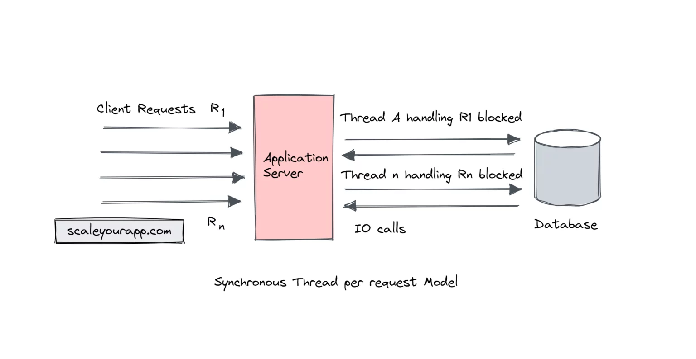
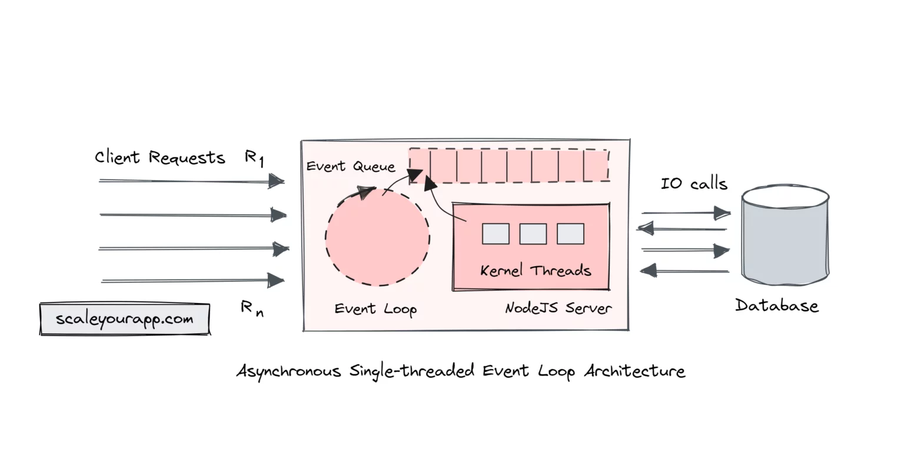

# Fundamentos Asincrónicos
**Modelos de Ejecución Asincrónica vs. Sincrónica**

**Ejecución Sincrónica:**
En un modelo de ejecución sincrónica, las tareas se ejecutan de manera secuencial. Cada tarea debe completarse antes de que la siguiente pueda comenzar. Este enfoque es sencillo y directo, pero puede ser ineficiente, especialmente cuando se trata de operaciones de entrada/salida (E/S) que son inherentemente lentas.

**Características Clave:**
- **Bloqueo:** En la ejecución sincrónica, el hilo actual se bloquea hasta que la tarea se completa.
- **Previsibilidad:** La secuencia de ejecución es fácil de seguir y depurar debido a su naturaleza lineal.
- **Ineficiencia:** El tiempo de espera para completar las operaciones de E/S puede causar que los recursos estén inactivos.

**Ejemplo Técnico:**
```java
public void synchronousMethod() {
    // Tarea 1
    fetchDataFromDatabase(); // Esta llamada bloquea hasta que los datos son recuperados
    // Tarea 2
    processData(); // Esta llamada comienza solo después de que la Tarea 1 ha finalizado
    // Tarea 3
    sendDataToClient(); // Esta llamada comienza solo después de que la Tarea 2 ha finalizado
}
```

**Ejecución Asincrónica:**
En un modelo de ejecución asincrónica, las tareas pueden iniciarse y ejecutarse sin esperar a que las tareas anteriores se completen. Este enfoque es particularmente útil para mejorar la eficiencia y el rendimiento, especialmente en aplicaciones con muchas operaciones de E/S o dependencias de red.

**Características Clave:**
- **No Bloqueo:** En la ejecución asincrónica, el hilo actual no se bloquea. En lugar de eso, se registran callbacks o se usan promesas/futuros para manejar el resultado de la operación una vez que se completa.
- **Concurrencia:** Permite que múltiples operaciones se ejecuten en paralelo, mejorando la utilización de recursos.
- **Complejidad:** Requiere un diseño más complejo y manejo de estados, pero ofrece un rendimiento significativamente mejor.

**Ejemplo Técnico:**
```java
public CompletableFuture<Void> asynchronousMethod() {
    CompletableFuture<Void> fetchFuture = fetchDataFromDatabaseAsync();
    CompletableFuture<Void> processFuture = fetchFuture.thenRun(() -> processData());
    CompletableFuture<Void> sendFuture = processFuture.thenRun(() -> sendDataToClient());
    return sendFuture;
}
```

**Ventajas de la Ejecución Asincrónica:**
- **Eficiencia:** Los recursos no están inactivos mientras esperan que se completen las operaciones de E/S.
- **Escalabilidad:** Mejora la capacidad de la aplicación para manejar múltiples tareas concurrentemente.
- **Responsividad:** Las aplicaciones permanecen responsivas y pueden manejar más cargas de trabajo simultáneamente.

**Desventajas de la Ejecución Asincrónica:**
- **Complejidad de Diseño:** Requiere un diseño cuidadoso para manejar correctamente los estados y errores.
- **Depuración y Mantenimiento:** Puede ser más difícil de depurar y mantener debido a la naturaleza concurrente del código.

En última instancia, la elección se reduce a las dependencias operativas. ¿Quieres que el inicio de una operación dependa de la finalización de otra operación, o prefieres que se ejecute de manera independiente?

La asincronía es una arquitectura no bloqueante, por lo que la ejecución de una tarea no depende de otra. Las tareas pueden ejecutarse simultáneamente.

La sincronía es una arquitectura bloqueante, por lo que la ejecución de cada operación depende de completar la anterior. Cada tarea requiere una respuesta antes de pasar a la siguiente iteración.

Las diferencias entre asincronía y sincronía incluyen:

- Async es multi-hilo, lo que significa que las operaciones o programas pueden ejecutarse en paralelo.
- Sync es de un solo hilo, por lo que solo una operación o programa se ejecutará a la vez.
- Async es no bloqueante, lo que significa que enviará múltiples solicitudes a un servidor.
- Sync es bloqueante: solo enviará una solicitud al servidor a la vez y esperará a que esa solicitud sea respondida por el servidor.
- Async aumenta el rendimiento porque múltiples operaciones pueden ejecutarse al mismo tiempo.
- Sync es más lento y metódico.

# Real World Scenario
Servicios en tiempo real como aplicaciones de chat, juegos MMO (Massive Multiplayer Online), sistemas de comercio financiero, aplicaciones con funciones de transmisión en vivo, etc., manejan un tráfico concurrente intenso y datos en tiempo real.

Estos servicios están limitados por las operaciones de E/S ya que dedican una gran parte de sus recursos a gestionar operaciones de entrada-salida como la comunicación de red de alto rendimiento y baja latencia (entre el cliente y el servidor y otros componentes de la aplicación), escrituras en bases de datos en tiempo real, E/S de archivos, comunicación con APIs de terceros, transmisión de datos en vivo, y así sucesivamente.

Los procesos clave en una aplicación concurrente en tiempo real, como se discutió anteriormente, como las operaciones de red de alto rendimiento, las escrituras en bases de datos, la comunicación entre componentes, etc., introducen latencia en el sistema debido a las operaciones de E/S.

Para mantener la latencia baja, se utilizan diferentes estrategias, como E/S no bloqueante, procesamiento asincrónico de eventos con arquitecturas de un solo hilo, el modelo de actores, programación reactiva, etc., que son aprovechadas por diferentes tecnologías web y frameworks en sus respectivos ecosistemas para implementar servicios en tiempo real escalables.

## El cuello de botella de E/S con el modelo sincrónico basado en hilos

Con el modelo sincrónico basado en hilos convencional que los servidores de aplicaciones utilizan para manejar las solicitudes de los clientes, los servicios a gran escala limitados por E/S enfrentan un cuello de botella en el rendimiento de las solicitudes.

Si tomo como ejemplo el servidor Apache Tomcat, cuando recibe una solicitud de un cliente, la solicitud se asigna a un hilo de trabajo del pool de hilos que mantiene para procesar las solicitudes.

En una aplicación limitada por E/S, la mayoría de las solicitudes realizarán operaciones de E/S, por ejemplo, lanzar una consulta a la base de datos. En este escenario, mientras la solicitud del servidor espera la respuesta de la base de datos, el hilo de trabajo está temporalmente bloqueado. No puede procesar otras solicitudes hechas al servidor.

Cada solicitud al servidor bloqueará temporalmente un hilo de trabajo mientras espera la respuesta de la base de datos. Una vez que la base de datos devuelve la respuesta y el servidor de aplicaciones devuelve la respuesta a la solicitud del cliente, el hilo de trabajo se libera de nuevo al pool de hilos para manejar otras solicitudes entrantes.



## Single-threaded Architecture 
### NodeJS Single-threaded Event Loop Architecture 

NodeJS, desde su núcleo, está diseñado para manejar de manera eficiente un gran número de solicitudes concurrentes y operaciones de E/S asincrónicas con un mínimo de sobrecarga, gracias a su arquitectura de bucle de eventos de un solo hilo. El bucle de eventos, que es el hilo principal y único, maneja todas las solicitudes de los clientes, delegando todas las operaciones de E/S al kernel del sistema operativo.



Dado que todas las tareas de E/S se delegan al kernel del sistema operativo, el bucle de eventos puede manejar futuras solicitudes de clientes sin ser bloqueado. NodeJS mantiene una cola de eventos para registrar los eventos pendientes y las devoluciones de llamada (callbacks). Esta cola es sondeada a intervalos regulares de manera no bloqueante por el hilo principal.

Así, por ejemplo, cuando un cliente envía una solicitud limitada por E/S al servidor NodeJS, se desencadena un evento y el bucle de eventos delega la operación de E/S al kernel del sistema operativo, registrando una devolución de llamada en la cola de eventos. El kernel del sistema operativo mantiene un pool de hilos de bajo nivel que utiliza para completar la operación de E/S.

Una vez que la operación de E/S se completa, por ejemplo, obteniendo la respuesta de la base de datos, el entorno de ejecución de Node desencadena un evento que indica que el procesamiento de la consulta está completo. El bucle de eventos ahora ejecuta la devolución de llamada registrada en la cola de eventos.

La devolución de llamada es una función que se ejecuta cuando el proceso de E/S se completa. Aquí, el bucle de eventos construye una respuesta con la información obtenida de la base de datos y la envía de vuelta al cliente.

Las devoluciones de llamada registradas en la cola de eventos son procesadas por el bucle de eventos en el orden en que se añaden.

Dado que NodeJS, a diferencia de Tomcat, no asocia un hilo con cada respuesta de cliente, sino que se basa en las operaciones de E/S no bloqueantes proporcionadas por el sistema operativo subyacente para ejecutar operaciones de E/S, esto reduce la sobrecarga de creación, gestión y cambio de contexto de hilos en NodeJS, haciendo el flujo de solicitud-respuesta más eficiente en recursos.

El paralelismo de las operaciones de E/S ocurre a nivel del sistema operativo mientras NodeJS permanece en un solo hilo. Este comportamiento no bloqueante lo hace adecuado para implementar servicios altamente concurrentes limitados por E/S, como juegos MMO, aplicaciones de chat, etc.

El comportamiento sincrónico bloqueante de Tomcat o cualquier otro servidor con comportamiento sincrónico bloqueante es adecuado para tareas limitadas por CPU, donde cada solicitud tiene su propio hilo y puede aprovechar múltiples núcleos de CPU.