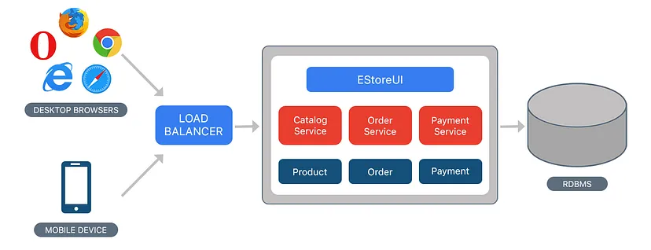
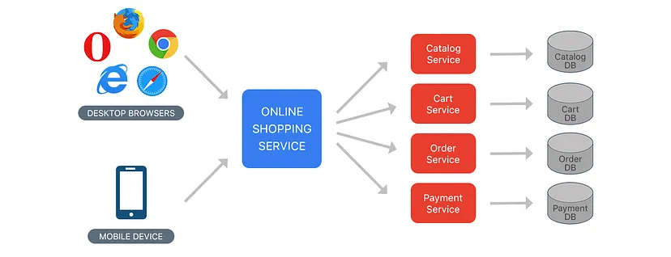
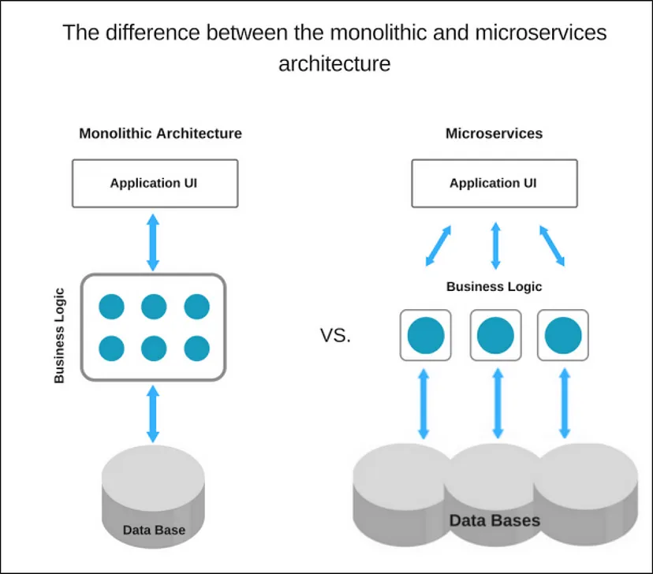
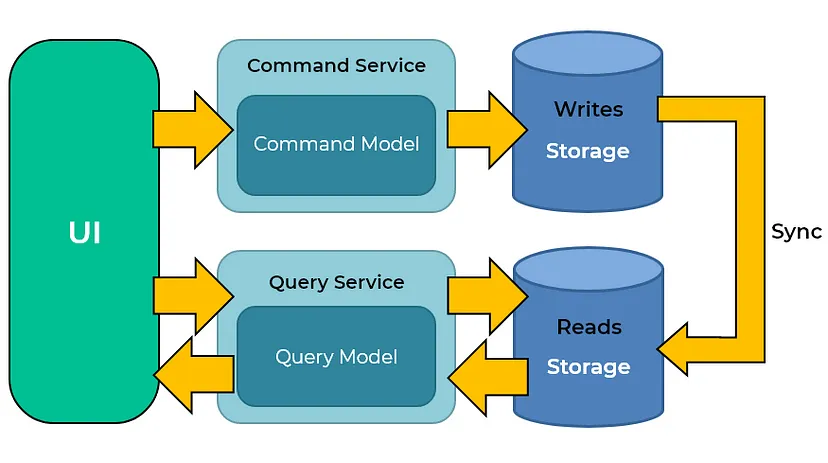
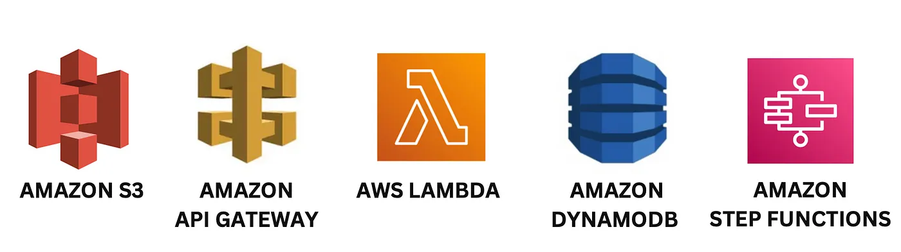

# Patrones Arquitectónicos

## ¿Qué son los Patrones Arquitectónicos?

Los patrones arquitectónicos son soluciones reutilizables y probadas para problemas comunes en el diseño de software. Proporcionan un esquema para estructurar sistemas de software de una manera que resuelva problemas recurrentes y mejore la mantenibilidad, escalabilidad y eficiencia del sistema.

### Importancia de los Patrones Arquitectónicos

1. **Reutilización de Conocimientos**: Los patrones encapsulan conocimientos y mejores prácticas acumuladas a lo largo del tiempo, permitiendo a los desarrolladores aprovechar soluciones probadas.
2. **Estandarización**: Facilitan un lenguaje común entre los desarrolladores y arquitectos, lo que mejora la comunicación y la coherencia en el diseño del sistema.
3. **Eficiencia en el Diseño**: Al proporcionar soluciones predefinidas, los patrones ahorran tiempo y esfuerzo en el diseño de la arquitectura, permitiendo centrarse en aspectos específicos del sistema.
4. **Mantenibilidad**: Una arquitectura bien diseñada usando patrones facilita la modificación y evolución del sistema sin comprometer su estabilidad.

## Tipos Comunes de Patrones Arquitectónicos

### **Monolítico**
- **Descripción**: Toda la funcionalidad del sistema está contenida en una única aplicación.
- **Ventajas**: Sencillez en el despliegue, menor latencia interna.
- **Desventajas**: Dificultad para escalar, mayor riesgo de fallos catastróficos.



### Beneficios y Desventajas de la Arquitectura Monolítica

#### Beneficios

1. **Desarrollo Simple**
    - **Descripción**: Al inicio de un proyecto, es mucho más sencillo optar por una arquitectura monolítica.
    - **Ejemplo**: Para proyectos de nueva creación, donde se necesita una rápida validación de conceptos, un monolito permite a los desarrolladores concentrarse en construir funcionalidades sin preocuparse por la división en servicios.

2. **Pruebas Simples**
    - **Descripción**: Es más fácil realizar pruebas integrales. Por ejemplo, puedes implementar pruebas end-to-end simplemente lanzando la aplicación y probando la interfaz de usuario con herramientas como Selenium.
    - **Ejemplo**: En una aplicación monolítica, probar la funcionalidad completa en un entorno integrado es directo, permitiendo detectar errores más fácilmente antes del despliegue.

3. **Despliegue Simple**
    - **Descripción**: Solo tienes que copiar la aplicación empaquetada a un servidor.
    - **Ejemplo**: Un monolito puede ser desplegado en un solo paso, sin la necesidad de manejar múltiples configuraciones y servicios.

4. **Escalabilidad Horizontal Simple**
    - **Descripción**: Se puede escalar horizontalmente ejecutando múltiples copias detrás de un balanceador de carga.
    - **Ejemplo**: Para manejar una mayor carga de usuarios, simplemente puedes añadir más instancias de la aplicación monolítica, todas manejadas por un balanceador de carga.

#### Desventajas

1. **Mantenimiento**
    - **Descripción**: Si la aplicación es demasiado grande y compleja para entenderla en su totalidad, es difícil realizar cambios de manera rápida y correcta.
    - **Ejemplo**: En aplicaciones grandes, cualquier cambio puede afectar a múltiples partes del sistema, requiriendo un análisis exhaustivo y pruebas extensas para garantizar que no se introduzcan errores.

2. **Tamaño y Tiempo de Inicio**
    - **Descripción**: El tamaño de la aplicación puede ralentizar el tiempo de inicio.
    - **Ejemplo**: Aplicaciones monolíticas grandes pueden tardar varios minutos en iniciar, lo que puede ser un problema durante el desarrollo y despliegue.

3. **Despliegue Completo en Cada Actualización**
    - **Descripción**: Debes volver a desplegar toda la aplicación en cada actualización.
    - **Ejemplo**: Incluso para cambios pequeños, como corregir un error menor en un módulo, se requiere desplegar todo el monolito, lo que puede ser ineficiente y arriesgado.

4. **Escalabilidad y Requisitos de Recursos**
    - **Descripción**: Las aplicaciones monolíticas pueden ser difíciles de escalar cuando diferentes módulos tienen requisitos de recursos conflictivos.
    - **Ejemplo**: Si un módulo requiere mucha memoria y otro mucho procesamiento, escalar adecuadamente ambos al mismo tiempo puede ser complejo y costoso.

5. **Confiabilidad**
    - **Descripción**: Un error en cualquier módulo (por ejemplo, una fuga de memoria) puede potencialmente derribar todo el proceso. Además, dado que todas las instancias de la aplicación son idénticas, ese error afecta la disponibilidad de toda la aplicación.
    - **Ejemplo**: Un error crítico en un módulo puede causar la caída de todo el sistema, impactando la disponibilidad y la experiencia del usuario.

6. **Dificultad para Adoptar Nuevas Tecnologías**
    - **Descripción**: Las aplicaciones monolíticas tienen dificultades para adoptar nuevas tecnologías. Dado que los cambios en lenguajes o frameworks afectan a toda la aplicación, requiere esfuerzos para trabajar detalladamente con la aplicación, lo cual es costoso tanto en tiempo como en esfuerzos.
    - **Ejemplo**: Migrar una aplicación monolítica grande a un nuevo framework o lenguaje puede ser una tarea monumental, a menudo requiriendo una reescritura significativa del código.


#### Ejemplos de Cuándo Usar Arquitecturas Monolíticas

La arquitectura monolítica puede ser una elección adecuada en varios escenarios. Aquí hay algunos ejemplos específicos de cuándo usar una arquitectura monolítica podría ser ventajoso:
- **Proyectos Pequeños y Medianos**
    - **Descripción**: Para aplicaciones de tamaño pequeño a mediano con funcionalidades limitadas y un alcance bien definido.
    - **Ejemplo**: Una aplicación interna para una pequeña empresa que gestiona tareas como el seguimiento de inventario, gestión de empleados y procesamiento de órdenes.
    - **Justificación**: La simplicidad de un monolito permite un desarrollo más rápido y una implementación más sencilla.

- **Equipos Pequeños**
    - **Descripción**: Cuando el equipo de desarrollo es pequeño y la coordinación entre diferentes módulos y servicios no es complicada.
    - **Ejemplo**: Una startup con un equipo de 3-5 desarrolladores construyendo una plataforma de ventas en línea.
    - **Justificación**: La administración centralizada de un monolito reduce la necesidad de complejas herramientas de orquestación y comunicación entre servicios.

- **Desarrollo Rápido de Prototipos**
    - **Descripción**: Para proyectos que requieren un rápido desarrollo y lanzamiento al mercado, como MVPs (Minimum Viable Products).
    - **Ejemplo**: Crear una versión inicial de una aplicación móvil para validar una idea de negocio.
    - **Justificación**: Un monolito permite iteraciones rápidas y cambios frecuentes sin preocuparse por la gestión de múltiples servicios.

- **Aplicaciones con Funcionalidades Altamente Interdependientes**
    - **Descripción**: Para sistemas donde las diferentes partes del código están estrechamente acopladas y dependen fuertemente unas de otras.
    - **Ejemplo**: Un sistema de reservas para un cine donde las funcionalidades de selección de asientos, pagos y generación de boletos están profundamente integradas.
    - **Justificación**: Mantener todo el código en una base de código unificada puede facilitar la gestión de estas interdependencias.

- **Presupuestos Limitados**
    - **Descripción**: Cuando los recursos económicos y tecnológicos son limitados, y no se justifica la complejidad de una arquitectura distribuida.
    - **Ejemplo**: Una organización sin fines de lucro desarrollando un sistema de gestión de donaciones.
    - **Justificación**: Los costos operativos y de infraestructura pueden mantenerse bajos con un monolito, ya que no requiere la misma inversión en orquestación y mantenimiento de múltiples servicios.

- **Requisitos de Rendimiento Interno**
    - **Descripción**: En aplicaciones donde la latencia interna debe ser mínima y la sobrecarga de la comunicación entre servicios es un problema.
    - **Ejemplo**: Una aplicación de análisis en tiempo real para una fábrica, que requiere procesamiento rápido de grandes volúmenes de datos.
    - **Justificación**: Un monolito evita la sobrecarga de red y la latencia asociada con las llamadas a servicios distribuidos.

- **Aplicaciones con un Ciclo de Vida Corto**
    - **Descripción**: Para aplicaciones que se espera tengan un ciclo de vida corto y no justifiquen una inversión significativa en una arquitectura compleja.
    - **Ejemplo**: Una aplicación para un evento único, como una conferencia o festival, que solo se usará durante un periodo limitado.
    - **Justificación**: La simplicidad y la rapidez de desarrollo de un monolito son más adecuadas para aplicaciones temporales.

- **Escenarios de Entrenamiento y Educación**
    - **Descripción**: Para proyectos educativos o de entrenamiento donde la simplicidad del desarrollo y la implementación es crucial.
    - **Ejemplo**: Una aplicación de ejemplo para un curso de programación que demuestra principios básicos de diseño y desarrollo.
    - **Justificación**: Un monolito permite a los estudiantes centrarse en aprender los fundamentos sin la distracción de una arquitectura distribuida compleja.

## Microservicios



### Microservicios en el Desarrollo de Aplicaciones

Los microservicios son un enfoque de desarrollo de aplicaciones en el cual una aplicación grande se construye como un conjunto de servicios modulares (es decir, módulos/componentes débilmente acoplados). Cada módulo apoya un objetivo específico del negocio y utiliza una interfaz simple y bien definida para comunicarse con otros conjuntos de servicios.

En lugar de compartir una única base de datos como en una aplicación monolítica, cada microservicio tiene su propia base de datos. Tener una base de datos por servicio es esencial si se desea aprovechar los beneficios de los microservicios, ya que garantiza un acoplamiento débil. Cada uno de los servicios tiene su propia base de datos. Además, un servicio puede usar el tipo de base de datos que mejor se adapte a sus necesidades.

Consideremos el mismo ejemplo de la aplicación de comercio electrónico, que consta de varios componentes/módulos. Definimos cada componente/módulo como un servicio separado y débilmente acoplado según el requerimiento, que puede colaborar entre sí según el escenario. Podemos tener los siguientes servicios para una aplicación completa:

### Servicios en una Aplicación de Comercio Electrónico

1. **Servicio de Autorización (Authorization Service)**
    - **Responsabilidad**: Autorizar a los clientes.
    - **Funcionalidades**: Gestión de autenticación de usuarios, autorización de permisos, manejo de sesiones.

2. **Servicio de Órdenes (Order Service)**
    - **Responsabilidad**: Tomar y procesar órdenes.
    - **Funcionalidades**: Creación de órdenes, seguimiento de estados de órdenes, manejo de cancelaciones y devoluciones.

3. **Servicio de Catálogo (Catalog Service)**
    - **Responsabilidad**: Gestionar productos y verificar el inventario de productos.
    - **Funcionalidades**: Gestión de productos, actualización de inventarios, búsqueda de productos.

4. **Servicio de Carrito (Cart Service)**
    - **Responsabilidad**: Gestionar el carrito de usuario, este servicio puede utilizar el servicio de catálogo como fuente de datos.
    - **Funcionalidades**: Añadir o quitar productos del carrito, calcular el total del carrito, mantener el estado del carrito entre sesiones.

5. **Servicio de Pago (Payment Service)**
    - **Responsabilidad**: Gestionar y autorizar pagos.
    - **Funcionalidades**: Procesamiento de pagos, validación de métodos de pago, gestión de transacciones seguras.

6. **Servicio de Envío (Shipping Service)**
    - **Responsabilidad**: Enviar los productos ordenados.
    - **Funcionalidades**: Calcular costos de envío, generar etiquetas de envío, seguimiento de envíos.

### Beneficios de los Microservicios

1. **Escalabilidad Independiente**
    - Cada servicio se puede escalar de manera independiente según su carga de trabajo, lo que mejora la eficiencia de los recursos.

2. **Desarrollo y Despliegue Autónomo**
    - Los equipos pueden trabajar de manera independiente en diferentes servicios y desplegar actualizaciones sin afectar a otros servicios.

3. **Flexibilidad Tecnológica**
    - Cada servicio puede usar el stack tecnológico que mejor se adapte a sus necesidades específicas.

4. **Resiliencia**
    - Un fallo en un servicio no afecta a los demás, mejorando la disponibilidad general del sistema.

### Desafíos de los Microservicios

1. **Complejidad Operacional**
    - La gestión de múltiples servicios y sus interacciones puede ser compleja y requiere herramientas avanzadas para orquestación y monitoreo.

2. **Gestión de Datos Distribuidos**
    - Mantener la consistencia de datos entre múltiples bases de datos puede ser complicado y a menudo requiere patrones como la Saga.

3. **Sobrecarga de Comunicación**
    - La comunicación entre servicios introduce latencia y puede ser un punto de fallo, por lo que es crucial diseñar mecanismos de comunicación robustos.

### Microservice vs Monolith



## CQRS Command Query Responsibility Segregation (CQRS) / Segregación de Responsabilidad de Comando y Consulta

### ¿Qué es CQRS?

La Segregación de Responsabilidad de Comando y Consulta (CQRS, por sus siglas en inglés) es un patrón arquitectónico que separa las operaciones de lectura y escritura en diferentes modelos. En lugar de usar el mismo modelo para modificar y consultar datos, CQRS sugiere utilizar modelos distintos, optimizados para cada propósito.



### Principios Básicos de CQRS

1. **Comandos**: Son operaciones que modifican el estado de la aplicación. Los comandos son procesos de escritura y pueden incluir operaciones como crear, actualizar o eliminar datos.
2. **Consultas**: Son operaciones que solo leen el estado de la aplicación. Las consultas son procesos de lectura y no deben modificar el estado de los datos.

### Beneficios de CQRS

1. **Optimización de Lecturas y Escrituras**
    - Al separar los modelos de lectura y escritura, cada uno puede ser optimizado para su propósito específico. Esto puede mejorar significativamente el rendimiento.

2. **Escalabilidad**
    - CQRS permite escalar las partes de lectura y escritura de la aplicación de manera independiente. Por ejemplo, si una aplicación tiene muchas más lecturas que escrituras, se pueden escalar los modelos de lectura sin necesidad de escalar los de escritura.

3. **Mantenibilidad y Flexibilidad**
    - Separar las responsabilidades facilita el mantenimiento del código y la implementación de cambios. Los desarrolladores pueden trabajar en mejoras de rendimiento o cambios funcionales en una parte sin afectar la otra.

4. **Seguridad**
    - Dado que las lecturas y escrituras están separadas, es más fácil aplicar políticas de seguridad específicas para cada operación.

### Desventajas de CQRS

1. **Complejidad**
    - Implementar CQRS añade complejidad a la arquitectura de la aplicación. Es necesario gestionar dos modelos diferentes y mantener la sincronización entre ellos.

2. **Sincronización de Datos**
    - Asegurar que los datos de los modelos de lectura y escritura estén sincronizados puede ser desafiante y puede requerir mecanismos de consistencia eventual.

3. **Costos Adicionales**
    - La necesidad de mantener y operar dos modelos puede incrementar los costos de infraestructura y desarrollo.

### Ejemplo de CQRS

Consideremos un sistema de gestión de pedidos en una aplicación de comercio electrónico:

1. **Modelo de Comando**:
    - **Crear Pedido**: Crea un nuevo pedido con los detalles del cliente y los productos.
    - **Actualizar Pedido**: Actualiza la información de un pedido existente, como el estado de envío.
    - **Cancelar Pedido**: Marca un pedido como cancelado y actualiza el inventario.

2. **Modelo de Consulta**:
    - **Obtener Detalles del Pedido**: Recupera los detalles de un pedido específico, incluyendo productos, precios y estado de envío.
    - **Listar Pedidos del Cliente**: Muestra una lista de todos los pedidos realizados por un cliente.
    - **Consultar Estado del Pedido**: Recupera el estado actual de un pedido específico.

#### Implementación de CQRS

1. **Separación de Modelos**
    - Define modelos de dominio separados para los comandos y las consultas. Estos modelos pueden tener estructuras de datos diferentes y pueden estar almacenados en bases de datos distintas si es necesario.

2. **Gestión de Comandos**
    - Utiliza un sistema de manejo de comandos para procesar las operaciones de escritura. Cada comando se traduce en una acción específica en el modelo de escritura.

3. **Gestión de Consultas**
    - Utiliza consultas para recuperar datos del modelo de lectura. Estas consultas deben estar optimizadas para un acceso rápido y eficiente.

4. **Sincronización de Datos**
    - Implementa mecanismos para sincronizar los datos entre los modelos de escritura y lectura. Esto puede incluir el uso de eventos, colas de mensajes o patrones de consistencia eventual.

### Consistencia Eventual y Desafíos en CQRS

Una consecuencia notable de la Segregación de Responsabilidad de Comando y Consulta (CQRS) es la implicación de la **consistencia eventual**, donde los cambios realizados a través de comandos pueden no reflejarse de inmediato en los modelos de lectura. Aunque este enfoque permite escalabilidad y flexibilidad, introduce complejidades, especialmente en escenarios donde la aplicación depende de la consistencia de datos en tiempo real o casi en tiempo real.

#### Estrategias para Manejar la Consistencia Eventual

1. **Arquitecturas Orientadas a Eventos**
    - **Descripción**: Implementar una arquitectura orientada a eventos (Event-Driven Architecture) para manejar la sincronización de datos.
    - **Funcionamiento**: Cada cambio en el modelo de escritura genera un evento que se publica en un bus de eventos. Los consumidores de eventos actualizan el modelo de lectura en consecuencia.
    - **Beneficios**: Permite una sincronización asincrónica y desacoplada entre los modelos de escritura y lectura.

   ```java
   // Ejemplo de un evento
   public class OrderCreatedEvent {
       private String orderId;
       private String customerId;
       private List<OrderItem> items;
       // Constructor, getters y setters
   }

   // Publicación de eventos
   public class OrderService {
       private EventPublisher eventPublisher;

       public void createOrder(Order order) {
           // Lógica para crear el pedido
           eventPublisher.publish(new OrderCreatedEvent(order.getId(), order.getCustomerId(), order.getItems()));
       }
   }

   // Consumidor de eventos
   public class OrderEventListener {
       private OrderReadRepository orderReadRepository;

       public void onOrderCreated(OrderCreatedEvent event) {
           // Actualización del modelo de lectura
           orderReadRepository.save(new OrderDetails(event.getOrderId(), event.getCustomerId(), event.getItems()));
       }
   }
   ```

2. **Bases de Datos Especializadas**
    - **Descripción**: Utilizar bases de datos especializadas que soporten tanto operaciones transaccionales como de consulta, optimizando la sincronización de datos.
    - **Ejemplo**: Bases de datos como Apache Kafka para manejo de eventos, o bases de datos noSQL como MongoDB para modelos de lectura rápidos y escalables.
    - **Beneficios**: Mejor rendimiento en la sincronización y acceso rápido a los datos.

#### Desafíos de la Consistencia Eventual

1. **Complejidad de Implementación**
    - **Descripción**: La implementación de arquitecturas orientadas a eventos o la integración de bases de datos especializadas introduce una capa adicional de complejidad.
    - **Solución**: Diseñar cuidadosamente el flujo de datos y los mecanismos de sincronización para asegurar un rendimiento óptimo sin comprometer la consistencia.

2. **Sobrecarga de Mantenimiento**
    - **Descripción**: Mantener modelos de lectura y escritura separados puede resultar en una sobrecarga significativa, especialmente cuando el proceso de sincronización es intensivo en recursos.
    - **Solución**: Optimizar los mecanismos de sincronización de datos para prevenir cuellos de botella. Utilizar técnicas como la desnormalización y el almacenamiento en caché para mejorar el rendimiento de las consultas.

3. **Garantizar el Rendimiento del Sistema**
    - **Descripción**: La sincronización entre modelos puede afectar el rendimiento general del sistema si no se gestiona adecuadamente.
    - **Solución**: Monitorizar continuamente el rendimiento del sistema y ajustar las estrategias de sincronización y el diseño de la arquitectura según sea necesario.

### Conclusión

CQRS es un patrón poderoso que, cuando se aplica adecuadamente, puede mejorar la escalabilidad, el rendimiento y la mantenibilidad de una aplicación. Sin embargo, también introduce complejidad adicional, por lo que debe ser implementado con cuidado, considerando los requerimientos específicos y la capacidad del equipo de desarrollo para manejar dicha complejidad.

## **Serverless (Serverless)**
### Computación Serverless (Serverless Computing)



En los últimos años, la computación Serverless se ha convertido en un modelo popular de computación en la nube. Este modelo permite a los desarrolladores construir y desplegar aplicaciones sin tener que gestionar servidores. Amazon Web Services (AWS) ofrece una amplia gama de servicios de computación Serverless, tales como AWS Lambda, Amazon API Gateway, Amazon DynamoDB y AWS Step Functions.

### ¿Qué es la Computación Serverless y Cómo Funciona?

Imagina que necesitas agua para tu casa. Podrías gastar mucho tiempo y dinero cavando un pozo, probando la calidad del agua y bombeando el agua hasta tu casa. O podrías conectarte al suministro de agua de la ciudad y pagar una tarifa mensual basada en la cantidad de agua que usas.

La computación Serverless es la misma idea, pero en lugar de agua, hablamos de la cantidad de CPU y memoria que se necesita para ejecutar tu código.

La computación Serverless es un modelo de computación en la nube que permite construir y desplegar aplicaciones sin gestionar servidores o infraestructuras. Con la computación Serverless, las empresas solo pagan por los recursos de computación que utilizan, sin tener que pagar por una cantidad fija de recursos por adelantado. Esto hace que la computación Serverless sea una solución rentable para las empresas que desean reducir los costos de infraestructura y mejorar la eficiencia.

La computación Serverless funciona permitiendo a las empresas ejecutar código en respuesta a eventos, tales como solicitudes de usuarios o cambios en la base de datos. Cuando ocurre un evento, se ejecuta automáticamente el código necesario para responder a ese evento. Este código puede ser escrito en una variedad de lenguajes de programación, como Node.js, Python, Java, C# y Go.

### Beneficios de la Computación Serverless para las Empresas

La computación Serverless ofrece varios beneficios para las empresas, incluyendo:

1. **Reducción de Costos de Infraestructura**
    - Solo se paga por los recursos de computación que se utilizan, lo que puede resultar en ahorros significativos.
2. **Escalabilidad**
    - Permite escalar aplicaciones automáticamente en respuesta a cambios en la demanda. Los desarrolladores no tienen que preocuparse por gestionar servidores o infraestructuras para escalar.
3. **Tiempo Rápido de Salida al Mercado**
    - Permite a las empresas construir y desplegar aplicaciones rápidamente.
4. **Alta Disponibilidad**
    - Las plataformas están diseñadas para ser altamente disponibles, lo que significa que las empresas pueden confiar en que estarán operativas en todo momento.
5. **Modelo de Pago por Uso**
    - Se cobra en función del número de solicitudes o eventos procesados, lo que facilita a las empresas rastrear su uso y costos.

### Casos de Uso de la Computación Serverless

1. **Aplicaciones Web y Móviles**
    - Excelente opción para construir aplicaciones web y móviles que necesitan una infraestructura escalable y rentable.
2. **Procesamiento y Análisis de Datos**
    - Se puede usar para procesar y analizar grandes cantidades de datos en tiempo real.
3. **Chatbots**
    - Permite construir y desplegar chatbots que pueden interactuar con los usuarios en tiempo real.
4. **Aplicaciones de IoT**
    - Se puede utilizar en aplicaciones de IoT para procesar y analizar datos de sensores y dispositivos.

### Limitaciones de la Computación Serverless

Aunque la computación Serverless ofrece muchos beneficios, también tiene algunas limitaciones:

1. **Latencia**
    - Puede haber una pequeña latencia inicial cuando se activa una función por primera vez (conocido como "cold start").
2. **Límites de Ejecución**
    - Las funciones Serverless a menudo tienen límites de tiempo de ejecución, lo que puede ser un desafío para tareas de larga duración.
3. **Complejidad en la Gestión de Estados**
    - Manejar estados y sesiones en un entorno Serverless puede ser más complejo y puede requerir soluciones adicionales como bases de datos externas o almacenamiento en caché.

### Conclusión

La computación Serverless es un modelo poderoso y flexible que permite a las empresas construir y desplegar aplicaciones sin la carga de gestionar servidores e infraestructuras. Ofrece beneficios significativos en términos de costos, escalabilidad y rapidez de despliegue. Sin embargo, también introduce nuevas complejidades que deben ser gestionadas cuidadosamente para aprovechar al máximo sus ventajas. Con servicios como AWS Lambda, Amazon API Gateway, Amazon DynamoDB y AWS Step Functions, AWS proporciona una sólida plataforma para implementar aplicaciones Serverless de manera efectiva.

### Consideraciones al Elegir un Patrón Arquitectónico

- **Requisitos del Sistema**: Analiza las necesidades funcionales y no funcionales del sistema.
- **Escalabilidad**: Determina si el patrón puede escalar adecuadamente según las previsiones de crecimiento.
- **Complejidad**: Considera la complejidad inherente del patrón y la capacidad del equipo para gestionarlo.
- **Mantenibilidad**: Evalúa cuán fácil será mantener y evolucionar el sistema a lo largo del tiempo.
- **Costos**: Considera tanto los costos de desarrollo como los operativos.


