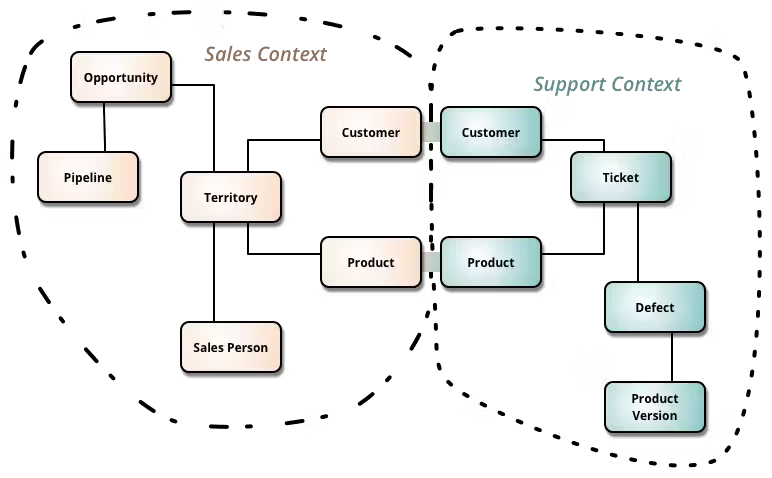

# Microservicios de nuevo!

### Domain-Driven Design (DDD) y Microservicios

La combinación de Domain-Driven Design (DDD) y microservicios es una estrategia efectiva para construir sistemas complejos y escalables. Aquí se explica cómo se relacionan y cómo se pueden implementar juntos con más detalle.

### Domain-Driven Design (DDD)

**Domain-Driven Design (DDD)** es una metodología que se enfoca en entender y modelar el dominio del problema, y en desarrollar software en colaboración con expertos del dominio. Sus conceptos clave son:

1. **Ubiquitous Language (Lenguaje Ubicuo)**:
    - Un lenguaje común compartido por desarrolladores y expertos del dominio.
    - Asegura que todos entiendan los conceptos del negocio de la misma manera.

2. **Bounded Context (Contexto Delimitado)**:
    - Un límite explícito dentro del cual un modelo es coherente.
    - Cada contexto tiene sus propias reglas, conceptos y definiciones.



3. **Entities (Entidades)**:
    - Objetos con identidad única que persiste a lo largo del tiempo.
    - Ejemplo: Un "Pedido" en un sistema de e-commerce.

4. **Value Objects (Objetos de Valor)**:
    - Objetos que se definen por sus atributos y no tienen identidad.
    - Ejemplo: Una "Dirección" en un sistema de e-commerce.

5. **Aggregates (Agregados)**:
    - Un conjunto de entidades y objetos de valor que se tratan como una unidad.
    - Tiene una raíz de agregado que controla el acceso a sus componentes.

6. **Repositories (Repositorios)**:
    - Interfaces para acceder a los agregados desde una base de datos.
    - Aislando la lógica del dominio de los detalles de persistencia.

7. **Services (Servicios)**:
    - Operaciones que no pertenecen a ninguna entidad u objeto de valor específico.
    - Ejemplo: Un servicio de cálculo de impuestos.

Es importante aclarar que **Domain-Driven Design (DDD)** no es una arquitectura por sí misma, sino una metodología y una colección de patrones y buenas prácticas para el desarrollo de software, especialmente útil en dominios complejos. La esencia de DDD está en entender y modelar el dominio del problema, identificando los límites (boundaries) y utilizando el lenguaje ubicuo compartido entre desarrolladores y expertos del dominio. Aquí está una explicación más detallada para reflejar esta perspectiva:

### Patrones Tácticos y Estratégicos

**Patrones Tácticos**:
- **Entidades**: Objetos con identidad.
- **Value Objects**: Objetos definidos por sus atributos.
- **Repositorios**: Abstracciones para el acceso a datos.
- **Agregados**: Grupos de entidades y objetos de valor con consistencia interna.
- **Servicios de Dominio**: Lógica que no encaja en entidades ni objetos de valor.
- **Factories**: Métodos para crear agregados y entidades.

**Patrones Estratégicos**:
- **Bounded Contexts**: Áreas del dominio con modelos coherentes.
- **Context Maps**: Diagramas que muestran cómo los bounded contexts se relacionan entre sí.
- **Event Storming**: Talleres para descubrir eventos del dominio y definir procesos.

### Enfoque en el Dominio

Al aplicar DDD, es crucial no obsesionarse con los patrones tácticos en detrimento del entendimiento del dominio y la definición de los límites. Los patrones tácticos son herramientas útiles, pero no son el objetivo principal. El verdadero valor de DDD reside en:

1. **Identificación de Bounded Contexts**:
   - Define claramente los límites de cada contexto del dominio.
   - Asegura que cada equipo tenga un modelo coherente y específico para su contexto.

2. **Colaboración y Lenguaje Ubicuo**:
   - Trabaja continuamente con los expertos del dominio para mantener y refinar el lenguaje ubicuo.
   - Usa este lenguaje en todos los artefactos del proyecto (código, documentación, conversaciones).

3. **Modelado Colaborativo**:
   - Utiliza técnicas como Event Storming para descubrir y refinar el modelo del dominio.
   - Asegura que el modelo refleja fielmente las reglas y lógica del negocio.

### Ejemplo Práctico

#### Contexto: E-commerce

**Bounded Contexts y Microservicios**:

1. **Order Management Service (Servicio de Gestión de Pedidos)**:
    - Funciones: Crear, actualizar y gestionar pedidos.
    - Entidades: Pedido, Línea de Pedido.
    - Agregados: Pedido (contiene líneas de pedido).

2. **Inventory Management Service (Servicio de Gestión de Inventario)**:
    - Funciones: Gestionar el inventario de productos.
    - Entidades: Producto, Stock.
    - Agregados: Producto (contiene información de stock).

3. **Customer Management Service (Servicio de Gestión de Clientes)**:
    - Funciones: Gestionar la información de los clientes.
    - Entidades: Cliente, Dirección.
    - Agregados: Cliente (contiene direcciones).

4. **Payment Processing Service (Servicio de Procesamiento de Pagos)**:
    - Funciones: Procesar pagos y gestionar transacciones.
    - Entidades: Pago, Transacción.
    - Agregados: Pago (contiene transacciones).

#### Implementación

1. **Definición del Lenguaje Ubicuo**:
    - Trabaja con los expertos del dominio para definir un lenguaje común.
    - Ejemplo: "Un pedido es una solicitud de compra de uno o más productos realizada por un cliente".

El lenguaje ubicuo (Ubiquitous Language) es un concepto fundamental en Domain-Driven Design (DDD) que promueve el uso de un lenguaje común y compartido entre desarrolladores y expertos del dominio. Este lenguaje debe ser utilizado en todo el ciclo de vida del desarrollo de software, desde la conversación inicial hasta la implementación y documentación del código.

### Ejemplos de Lenguaje Ubicuo

#### Dominio de Comercio Electrónico

1. **Cliente (Customer)**
   - **Cliente**: Una persona o entidad que realiza compras en la plataforma.
   - **Cuenta de Cliente**: Información y preferencias de un cliente registrado.
   - **Carrito de Compras**: Una colección temporal de productos que el cliente desea comprar.

2. **Pedido (Order)**
   - **Pedido**: Una solicitud formal para comprar productos.
   - **Estado del Pedido**: El estado actual del pedido (ej. Pendiente, Procesado, Enviado, Entregado, Cancelado).
   - **Línea de Pedido**: Un producto individual dentro de un pedido.

3. **Producto (Product)**
   - **Producto**: Un artículo disponible para la venta.
   - **Inventario**: La cantidad disponible de un producto específico.
   - **Categoría de Producto**: Clasificación de productos (ej. Electrónica, Ropa, Alimentos).

4. **Pago (Payment)**
   - **Transacción de Pago**: Un registro de pago realizado por un cliente.
   - **Método de Pago**: La forma en que se realiza el pago (ej. Tarjeta de Crédito, PayPal, Transferencia Bancaria).
   - **Estado del Pago**: El estado de la transacción de pago (ej. Aprobado, Rechazado, Pendiente).

#### Dominio de Finanzas Personales

1. **Cuenta Bancaria (Bank Account)**
   - **Cuenta Bancaria**: Un registro financiero que mantiene un banco en nombre de un cliente.
   - **Saldo**: La cantidad de dinero disponible en la cuenta.
   - **Tipo de Cuenta**: Clasificación de la cuenta (ej. Cuenta de Ahorro, Cuenta Corriente).

2. **Transacción (Transaction)**
   - **Transacción**: Un movimiento de dinero hacia o desde una cuenta.
   - **Depósito**: Un incremento en el saldo de la cuenta.
   - **Retiro**: Una disminución en el saldo de la cuenta.

3. **Presupuesto (Budget)**
   - **Presupuesto**: Una planificación de ingresos y gastos para un periodo específico.
   - **Categoría de Gasto**: Clasificación de los gastos (ej. Alquiler, Comida, Transporte).
   - **Meta de Ahorro**: Un objetivo financiero para ahorrar una cantidad específica de dinero.

4. **Inversión (Investment)**
   - **Inversión**: La asignación de dinero a un activo con la expectativa de obtener un retorno.
   - **Riesgo**: La posibilidad de pérdida asociada con una inversión.
   - **Retorno**: La ganancia obtenida de una inversión.

#### Dominio de Gestión de Proyectos

1. **Proyecto (Project)**
   - **Proyecto**: Un esfuerzo temporal con el objetivo de crear un producto o servicio único.
   - **Fase del Proyecto**: Etapas del ciclo de vida del proyecto (ej. Inicio, Planificación, Ejecución, Cierre).
   - **Cronograma**: Un plan detallado de las actividades del proyecto y sus tiempos.

2. **Tarea (Task)**
   - **Tarea**: Una unidad de trabajo dentro de un proyecto.
   - **Asignado a**: La persona responsable de completar la tarea.
   - **Estado de la Tarea**: El estado actual de la tarea (ej. Pendiente, En Progreso, Completada).

3. **Recurso (Resource)**
   - **Recurso**: Cualquier cosa necesaria para completar el proyecto (ej. Personal, Equipos, Materiales).
   - **Asignación de Recursos**: El proceso de asignar recursos a tareas específicas.
   - **Capacidad**: La cantidad máxima de trabajo que un recurso puede realizar.

4. **Riesgo (Risk)**
   - **Riesgo**: Un evento o condición incierta que, si ocurre, tiene un efecto positivo o negativo en los objetivos del proyecto.
   - **Impacto**: La consecuencia de que el riesgo ocurra.
   - **Mitigación**: Estrategias para reducir la probabilidad o el impacto del riesgo.

### Cómo Usar el Lenguaje Ubicuo

1. **En Reuniones y Documentación**:
   - Utiliza los términos del lenguaje ubicuo en todas las conversaciones, reuniones y documentos de requisitos.
   - Ejemplo: "Necesitamos actualizar el **estado del pedido** a **Enviado** cuando el **envío** se complete."

2. **En Código**:
   - Utiliza los términos del lenguaje ubicuo en nombres de clases, métodos y variables.
   - Ejemplo:
     ```java
     public class Order {
         private String orderId;
         private List<OrderLine> orderLines;
         private OrderStatus status;
     }
     
     public class OrderLine {
         private String productId;
         private int quantity;
         private Money price;
     }
     
     public enum OrderStatus {
         PENDING, PROCESSED, SHIPPED, DELIVERED, CANCELLED
     }
     ```

3. **En Pruebas**:
   - Utiliza el lenguaje ubicuo en los nombres de las pruebas y en las aserciones.
   - Ejemplo:
     ```java
     @Test
     public void shouldUpdateOrderStatusToShipped() {
         // Given
         Order order = new Order("orderId123");
         
         // When
         order.updateStatus(OrderStatus.SHIPPED);
         
         // Then
         assertEquals(OrderStatus.SHIPPED, order.getStatus());
     }
     ```

### Beneficios de DDD y Microservicios

1. **Modularidad**:
    - Mejora la modularidad del sistema, facilitando la comprensión y el mantenimiento.

2. **Escalabilidad**:
    - Permite escalar partes específicas del sistema según la demanda.

3. **Resiliencia**:
    - Un fallo en un microservicio no afecta a todo el sistema.

4. **Flexibilidad en el Desarrollo**:
    - Diferentes equipos pueden trabajar en distintos microservicios de manera independiente.

### Desafíos

1. **Gestión de la Consistencia**:
    - Mantener la consistencia de datos entre microservicios puede ser complicado.
    - Usa patrones como Eventual Consistency y Sagas para manejar transacciones distribuidas.

2. **Latencia y Rendimiento**:
    - La comunicación entre microservicios introduce latencia.
    - Optimiza las llamadas a servicios y utiliza técnicas como el caching y la compresión de datos.

3. **Monitoreo y Depuración**:
    - Monitorear un sistema distribuido es más complejo.
    - Usa herramientas avanzadas de monitoreo y trazabilidad (como ELK stack, Prometheus, Jaeger).
