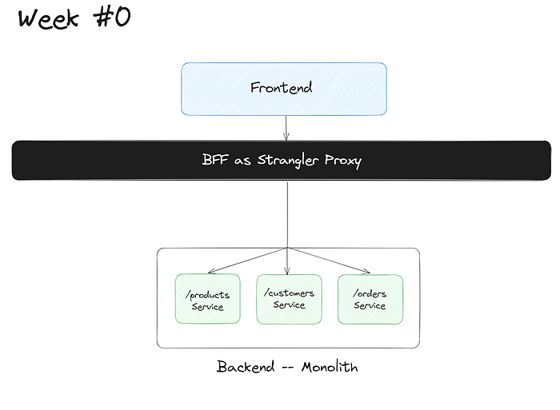
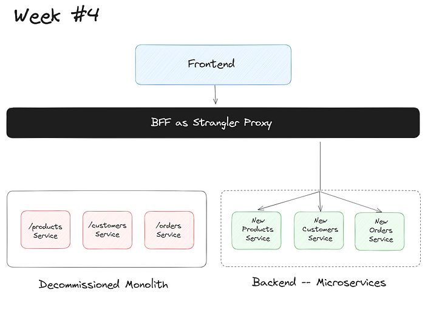

# Migrating from Monolithic to Microservices

## Strangler Fig Pattern

El **Strangler Fig Pattern** es una estrategia efectiva para refactorizar y migrar un sistema monolítico a una arquitectura de microservicios de manera incremental. Este patrón toma su nombre de las plantas estranguladoras que crecen alrededor de un árbol anfitrión, eventualmente reemplazándolo sin que el anfitrión deje de existir hasta que la planta esté completamente formada.

### ¿Qué es el Strangler Fig Pattern?

El Strangler Fig Pattern consiste en envolver el sistema monolítico con nuevos microservicios que reemplazan gradualmente partes del sistema monolítico. A medida que los microservicios asumen más responsabilidades, el monolito se va "estrangulando" hasta que es completamente reemplazado.

### Fases del Strangler Fig Pattern

1. **Identificación de Funcionalidades**:
    - Analiza el sistema monolítico para identificar funcionalidades o módulos que pueden ser aislados y migrados.
    - Prioriza las funcionalidades según la complejidad, el riesgo y el impacto en el negocio.

2. **Implementación de Facade**:
    - Implementa una capa de fachada que redirija las solicitudes del cliente a los microservicios o al monolito según corresponda.
    - La fachada actúa como un punto de entrada que puede manejar la lógica de enrutamiento.

3. **Extracción Incremental de Funcionalidades**:
    - Extrae funcionalidades específicas del monolito y reescríbelas como microservicios.
    - Integra los microservicios con la fachada para que manejen las solicitudes pertinentes.

4. **Redirección de Tráfico**:
    - Gradualmente, dirige más tráfico desde la fachada a los microservicios a medida que estos asumen más responsabilidades.
    - Monitorea el rendimiento y el comportamiento del sistema para asegurar que no haya interrupciones.

5. **Desmantelamiento del Monolito**:
    - A medida que se migren todas las funcionalidades, reduce el tamaño del monolito hasta que sea completamente reemplazado por microservicios.
    - Finalmente, el monolito puede ser retirado del servicio.






### Beneficios del Strangler Fig Pattern

1. **Minimización de Riesgos**:
    - Permite la migración incremental, reduciendo el riesgo de grandes fallos.
    - Facilita pruebas y validaciones incrementales.

2. **Despliegue Gradual**:
    - Permite desplegar nuevas funcionalidades sin interrumpir el servicio existente.
    - Facilita la gestión de dependencias y la compatibilidad hacia atrás.

3. **Flexibilidad**:
    - Permite a los equipos trabajar en paralelo en diferentes funcionalidades.
    - Facilita la adopción de nuevas tecnologías y prácticas de desarrollo.

### Consideraciones

1. **Complejidad Inicial**:
    - La implementación de la fachada y la integración inicial puede ser compleja.
    - Requiere una planificación cuidadosa y una comprensión profunda del sistema monolítico.

2. **Gestión de Estado y Datos**:
    - La migración de datos y la sincronización del estado entre el monolito y los microservicios puede ser desafiante.
    - Se necesitan estrategias para mantener la consistencia de los datos.

3. **Monitoreo y Observabilidad**:
    - La transición a microservicios requiere una infraestructura robusta de monitoreo y logging.
    - Es crucial para detectar y resolver problemas rápidamente.

### Conclusión

El **Strangler Fig Pattern** es una estrategia poderosa para migrar de un monolito a una arquitectura de microservicios. Al permitir una migración incremental y controlada, ayuda a minimizar riesgos y facilita una transición más suave hacia un sistema más modular y escalable. Con una planificación cuidadosa y un enfoque estructurado, puedes descomponer tu monolito en microservicios sin interrumpir el servicio y mejorar significativamente la agilidad y la resiliencia de tu sistema.

## Incremental

Migrar de una arquitectura monolítica a una de microservicios de manera incremental es una estrategia efectiva para gestionar el riesgo y garantizar la estabilidad del sistema durante la transición. Aquí te presento una guía detallada para realizar esta migración incremental:

### 1. Evaluación Inicial

#### Entender la Arquitectura Actual
- **Inventario Completo**: Realiza un inventario de los componentes, módulos y dependencias del sistema monolítico.
- **Mapeo de Dependencias**: Identifica las interdependencias entre módulos.

#### Definir Objetivos
- **Claridad de Propósitos**: Define por qué migras a microservicios (ej. escalabilidad, despliegue independiente, resiliencia).
- **Resultados Esperados**: Establece métricas y objetivos claros para evaluar el éxito de la migración.

### 2. Planificación y Diseño

#### Identificación de Bounded Contexts
- **Domain-Driven Design (DDD)**: Utiliza DDD para identificar bounded contexts y definir los límites del dominio.
- **Context Maps**: Crea mapas de contexto para visualizar y planificar las interacciones entre diferentes bounded contexts.

#### Definir Microservicios
- **Microservicios Iniciales**: Selecciona las funcionalidades iniciales que se migrarán a microservicios.
- **Diseño de APIs**: Diseña APIs RESTful o de mensajería para la comunicación entre microservicios.

### 3. Implementación de la Infraestructura

#### Configuración de la Infraestructura
- **Contenedores y Orquestación**: Configura contenedores (Docker) y orquestadores (Kubernetes) para gestionar los microservicios.
- **Herramientas de DevOps**: Implementa pipelines de CI/CD para automatizar el despliegue y la integración continua.

#### Monitoreo y Logging
- **Soluciones de Monitoreo**: Utiliza herramientas como Prometheus y Grafana para monitorear el rendimiento.
- **Trazabilidad Distribuida**: Implementa herramientas como Jaeger o Zipkin para la trazabilidad de transacciones distribuidas.

### 4. Migración Gradual

#### Fase Inicial: Implementar la Facade
- **API Gateway**: Desarrolla un API Gateway que redirija las solicitudes a los microservicios o al monolito según corresponda.
- **Routing Inicial**: Inicialmente, todas las solicitudes pasan por el API Gateway hacia el monolito.

```plaintext
Client -> API Gateway -> Monolito
```

#### Fase 1: Migrar la Primera Funcionalidad
- **Selección de Funcionalidad**: Elige una funcionalidad menos crítica para empezar, por ejemplo, la gestión de pedidos.
- **Desarrollo del Microservicio**: Crea un `Order Service` que maneje la gestión de pedidos.
- **Integración con API Gateway**: Actualiza el API Gateway para redirigir las solicitudes de gestión de pedidos al nuevo `Order Service`.

```plaintext
Client -> API Gateway -> (Order Requests) -> Order Service
                         -> (Other Requests) -> Monolito
```

#### Fase 2: Pruebas y Validación
- **Pruebas Unitarias y de Integración**: Realiza pruebas exhaustivas del nuevo microservicio.
- **Pruebas de Aceptación**: Asegúrate de que la funcionalidad migrada cumple con los requisitos del negocio.

#### Fase 3: Monitoreo y Optimización
- **Monitoreo en Producción**: Monitorea el rendimiento y la estabilidad del `Order Service` en producción.
- **Ajustes y Optimización**: Realiza ajustes según sea necesario para optimizar el rendimiento.

#### Fase 4: Iterar con Más Funcionalidades
- **Planificación de la Siguiente Funcionalidad**: Selecciona la siguiente funcionalidad a migrar (ej. gestión de clientes, inventario).
- **Repetir el Proceso**: Sigue los mismos pasos para desarrollar, probar, desplegar y monitorear el nuevo microservicio.

```plaintext
Client -> API Gateway -> (Order Requests) -> Order Service
                         -> (Customer Requests) -> Customer Service
                         -> (Inventory Requests) -> Inventory Service
                         -> (Other Requests) -> Monolito
```

### 5. Desmantelamiento del Monolito

#### Reducción del Monolito
- **Migración Completa de Funcionalidades**: A medida que más funcionalidades se migran a microservicios, reduce el tamaño del monolito.
- **Desactivación Gradual**: Desactiva partes del monolito que han sido completamente reemplazadas.

#### Retiro Final del Monolito
- **Validación Completa**: Asegúrate de que todas las funcionalidades críticas se han migrado y funcionan correctamente en los microservicios.
- **Eliminación del Monolito**: Retira el monolito de producción cuando ya no sea necesario.

### Beneficios de la Migración Incremental

1. **Minimización de Riesgos**:
    - Los cambios incrementales reducen el riesgo de interrupciones importantes en el servicio.

2. **Despliegue Gradual**:
    - Permite desplegar y probar nuevas funcionalidades sin afectar el sistema existente.

3. **Adaptabilidad**:
    - Facilita la adaptación y optimización continua basada en feedback real del sistema.

4. **Mejora de la Escalabilidad y Resiliencia**:
    - Cada microservicio puede ser escalado de manera independiente y aislada, mejorando la resiliencia general del sistema.

### Consideraciones Clave

1. **Gestión de Dependencias**:
    - Maneja cuidadosamente las dependencias entre el monolito y los microservicios para evitar acoplamientos innecesarios.

2. **Sincronización de Datos**:
    - Implementa estrategias para sincronizar datos entre el monolito y los microservicios durante la transición.

3. **Monitoreo y Logging**:
    - Establece una infraestructura robusta de monitoreo y logging desde el principio para facilitar la detección y resolución de problemas.

La migración "Big-Bang" implica reemplazar todo el sistema monolítico de una sola vez con una nueva arquitectura de microservicios. Este enfoque puede ser riesgoso debido a la magnitud del cambio y a la dificultad de realizar una transición sin interrupciones. Aquí tienes una guía detallada sobre cómo realizar una migración "Big-Bang":

### ¿Qué es una Migración Big-Bang?

La migración Big-Bang implica detener el sistema monolítico y reemplazarlo completamente con una nueva implementación basada en microservicios en un solo evento de despliegue. A diferencia de la migración incremental, donde los cambios se realizan gradualmente, la migración Big-Bang intenta realizar la transición de una sola vez.

### Pasos para Realizar una Migración Big-Bang

#### 1. Evaluación y Planificación

**Evaluar la Arquitectura Actual**:
- **Inventario Completo**: Documenta todos los componentes del sistema monolítico.
- **Dependencias**: Identifica todas las dependencias internas y externas.

**Definir Objetivos y Alcance**:
- **Claridad en los Objetivos**: Define claramente los objetivos de la migración.
- **Alcance del Proyecto**: Establece el alcance de la migración y los límites del proyecto.

#### 2. Diseño de la Nueva Arquitectura

**Definir Microservicios**:
- **Bounded Contexts**: Utiliza Domain-Driven Design (DDD) para identificar bounded contexts.
- **Diseño de Microservicios**: Define los microservicios basados en los bounded contexts.

**Diseño de APIs**:
- **APIs RESTful o Mensajería**: Diseña APIs claras y bien documentadas para la comunicación entre microservicios.

**Infraestructura**:
- **Contenedores y Orquestación**: Planifica el uso de contenedores (Docker) y orquestadores (Kubernetes).

#### 3. Implementación

**Desarrollo de Microservicios**:
- **Crear Microservicios**: Desarrolla cada microservicio de acuerdo con los diseños y especificaciones.
- **Integración**: Asegura que los microservicios se integren correctamente y funcionen de manera cohesiva.

**Implementar Infraestructura de Soporte**:
- **CI/CD Pipelines**: Configura pipelines de CI/CD para automatizar el despliegue y las pruebas.
- **Monitoreo y Logging**: Implementa herramientas de monitoreo y logging para rastrear el rendimiento y detectar problemas.

#### 4. Pruebas Exhaustivas

**Pruebas Unitarias y de Integración**:
- **Cobertura Completa**: Asegúrate de tener una cobertura completa con pruebas unitarias e integraciones.

**Pruebas de Aceptación**:
- **Validación de Requisitos**: Realiza pruebas de aceptación para asegurar que los microservicios cumplen con los requisitos del negocio.

**Pruebas de Carga y Escalabilidad**:
- **Simulación de Cargas Reales**: Realiza pruebas de carga para asegurar que los microservicios puedan manejar el tráfico esperado.

#### 5. Planificación del Despliegue

**Estrategia de Despliegue**:
- **Ventana de Despliegue**: Planifica una ventana de despliegue adecuada que minimice la interrupción del negocio.
- **Plan de Contingencia**: Desarrolla un plan de contingencia en caso de fallos durante el despliegue.

**Migración de Datos**:
- **Estrategia de Migración de Datos**: Planifica cómo migrar los datos del sistema monolítico a los nuevos microservicios.
- **Pruebas de Integridad de Datos**: Asegura la integridad de los datos antes y después de la migración.

#### 6. Ejecución del Despliegue

**Desactivación del Monolito**:
- **Apagado Controlado**: Apaga el sistema monolítico de manera controlada.

**Activación de Microservicios**:
- **Despliegue Coordinado**: Despliega todos los microservicios en el nuevo entorno.
- **Monitoreo Intensivo**: Monitorea intensivamente el sistema para detectar y resolver problemas rápidamente.

#### 7. Post-Despliegue

**Monitoreo Continuo**:
- **Detección de Problemas**: Usa herramientas de monitoreo para detectar cualquier problema que surja.
- **Ajustes y Optimización**: Realiza ajustes necesarios para optimizar el rendimiento.

**Validación y Feedback**:
- **Validación de Funcionalidades**: Asegura que todas las funcionalidades del sistema funcionen como se espera.
- **Recopilación de Feedback**: Recoge feedback de los usuarios y stakeholders para identificar áreas de mejora.

### Beneficios de la Migración Big-Bang

1. **Transición Completa**:
    - El sistema entero se migra de una sola vez, eliminando la coexistencia del monolito y los microservicios.

2. **Simplificación del Despliegue**:
    - Un único despliegue puede simplificar la gestión de la infraestructura y la coordinación entre equipos.

### Desafíos de la Migración Big-Bang

1. **Riesgo Elevado**:
    - El riesgo de fallos es alto debido a la magnitud del cambio.
    - Problemas durante el despliegue pueden resultar en una interrupción significativa del servicio.

2. **Complejidad en la Ejecución**:
    - Requiere una coordinación precisa y una planificación detallada.
    - La migración de datos y la integración de sistemas pueden ser complejas.

3. **Monitoreo y Respuesta**:
    - Necesita un monitoreo intensivo y capacidad de respuesta rápida para resolver problemas post-despliegue.

### Consideraciones Clave

1. **Pruebas Exhaustivas**:
    - Realiza pruebas exhaustivas en todos los niveles para minimizar el riesgo de fallos.

2. **Plan de Contingencia**:
    - Ten un plan de contingencia robusto para revertir el despliegue en caso de problemas críticos.

3. **Capacitación y Preparación del Equipo**:
    - Asegúrate de que el equipo esté bien capacitado y preparado para manejar la nueva arquitectura y cualquier problema que surja.

### Gestionando la Transición a una Arquitectura de Microservicios

La transición exitosa de una arquitectura monolítica a una basada en microservicios requiere ajustes tanto organizacionales como técnicos. Esta sección destaca los cambios esenciales y las estrategias que facilitan una migración fluida hacia un marco de microservicios más dinámico y descentralizado.

#### Cambios Organizacionales

**Ajustes en la Estructura de Equipos**:
- **Equipos Descentralizados**: Alinea los equipos con servicios específicos o conjuntos de servicios para fomentar la propiedad y la responsabilidad.
    - **Ejemplo**: En lugar de tener un solo equipo responsable de toda la aplicación monolítica, crea equipos más pequeños y multifuncionales, cada uno responsable de un microservicio específico, como `Gestión de Pedidos`, `Gestión de Clientes` o `Procesamiento de Pagos`.
- **Equipos Autónomos**: Empodera a los equipos para tomar decisiones de manera independiente, acelerando los procesos de desarrollo y despliegue.
    - **Beneficio**: Los equipos pueden desarrollar, desplegar y escalar sus servicios sin depender de otros equipos, reduciendo los cuellos de botella.

**Fomentando una Cultura DevOps**:
- **Integración de Desarrollo y Operaciones**: Fomenta la colaboración entre los equipos de desarrollo y operaciones para mejorar la comunicación y la eficiencia.
    - **Práctica**: Implementa responsabilidades compartidas y una propiedad conjunta de la tubería de despliegue y los entornos de producción.
- **Integración y Entrega Continuas (CI/CD)**: Adopta prácticas de CI/CD para automatizar el proceso de desarrollo, pruebas y despliegue, asegurando que los cambios se implementen rápidamente y con alta calidad.

#### Desafíos Técnicos y Soluciones

**Mantenimiento de la Consistencia de Datos**:
- **Desafío**: Garantizar la consistencia de los datos entre los servicios distribuidos es uno de los mayores retos en microservicios.
- **Soluciones**:
    - **Arquitectura basada en eventos**: Implementar una arquitectura impulsada por eventos puede ayudar a gestionar el flujo y la integridad de los datos entre diferentes componentes.
    - **CQRS (Command Query Responsibility Segregation)**: Separar las operaciones de lectura y escritura puede mejorar la consistencia y el rendimiento.

**Descubrimiento de Servicios y Tolerancia a Fallos**:
- **Desafío**: A medida que aumenta el número de servicios, gestionar cómo los servicios se encuentran y se comunican entre sí se vuelve crucial.
- **Soluciones**:
    - **API Gateway**: Utilizar un gateway de API para gestionar el enrutamiento del tráfico y la autenticación.
    - **Service Mesh**: Adoptar arquitecturas de malla de servicios, como Istio, para manejar la comunicación de servicio a servicio, el enrutamiento del tráfico y la gestión de fallos de manera eficiente.

**Adopción de Tecnologías Nativas en la Nube**:
- **Desafío**: Gestionar, escalar y desplegar aplicaciones de microservicios puede ser complejo sin las herramientas adecuadas.
- **Soluciones**:
    - **Orquestación de Contenedores**: Utilizar plataformas como Kubernetes para orquestar contenedores puede facilitar significativamente la gestión de microservicios.
    - **Infraestructura como Código (IaC)**: Emplear herramientas de IaC como Terraform para automatizar la configuración y el despliegue de la infraestructura en la nube.

### Estrategias para una Transición Efectiva

**Planificación y Pruebas Exhaustivas**:
- **Estrategia de Migración Gradual**: Planifica una migración paso a paso en lugar de un gran cambio de una vez. Utiliza el patrón Strangler Fig para migrar funcionalidades incrementales.
- **Pruebas Completa**: Realiza pruebas exhaustivas en todas las etapas, desde unitarias hasta integrales, para asegurar que cada microservicio funcione correctamente antes de pasar a la producción.

**Monitoreo y Observabilidad**:
- **Implementación de Herramientas de Monitoreo**: Utiliza herramientas de monitoreo y logging para obtener visibilidad sobre el rendimiento y el estado de los servicios.
- **Trazabilidad Distribuida**: Implementa trazabilidad distribuida para rastrear las transacciones a través de múltiples servicios, facilitando la detección y resolución de problemas.

### Conclusión

Gestionar la transición de un sistema monolítico a una arquitectura de microservicios requiere cambios organizacionales significativos y la adopción de soluciones técnicas robustas. Ajustar la estructura del equipo, fomentar una cultura DevOps, y abordar los desafíos técnicos con estrategias bien planificadas y herramientas adecuadas, asegura una migración efectiva y sostenible hacia una arquitectura de microservicios.