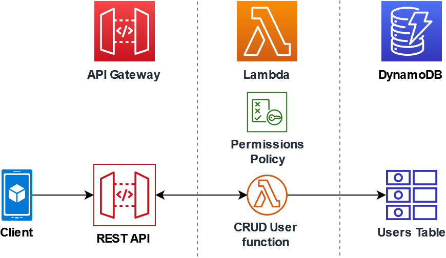
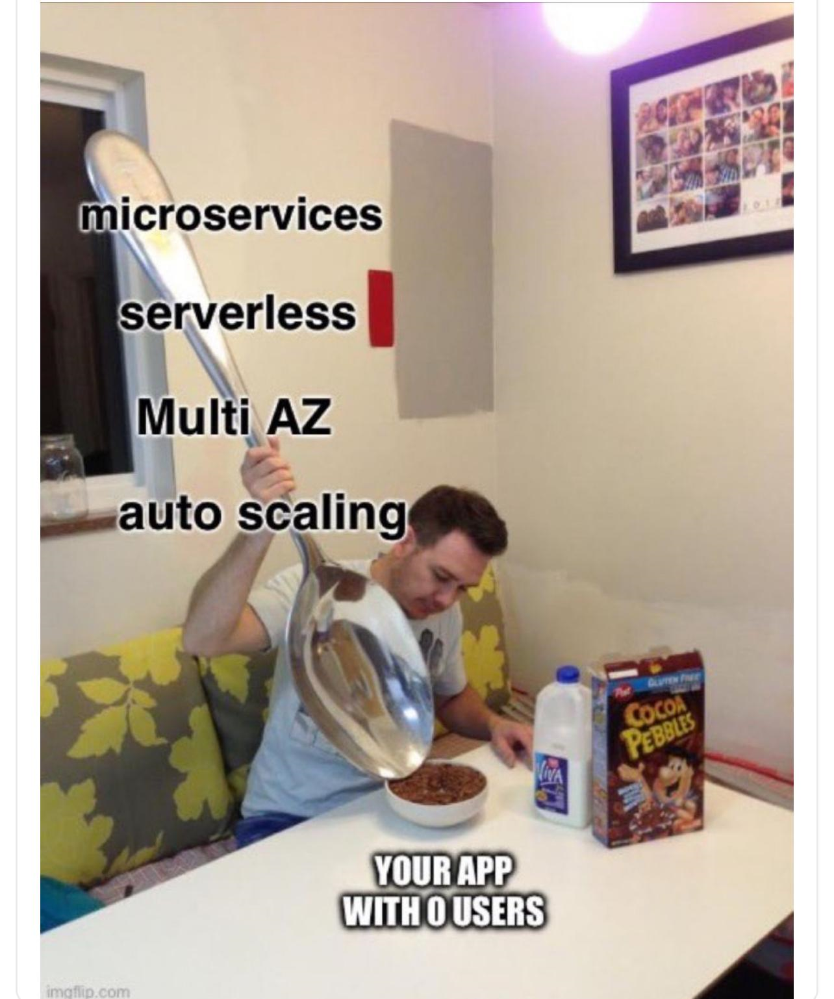

# Demo Serverless



## Crear Security Policy

1. ir a [Policies](https://console.aws.amazon.com/iam/home#/policies)
2. Copiar y pegar JSON en la poliza
```json
{
  "Version": "2012-10-17",
  "Statement": [
    {
      "Sid": "Stmt1428341300017",
      "Action": [
        "dynamodb:DeleteItem",
        "dynamodb:GetItem",
        "dynamodb:PutItem",
        "dynamodb:Query",
        "dynamodb:Scan",
        "dynamodb:UpdateItem"
      ],
      "Effect": "Allow",
      "Resource": "*"
    },
    {
      "Sid": "",
      "Resource": "*",
      "Action": [
        "logs:CreateLogGroup",
        "logs:CreateLogStream",
        "logs:PutLogEvents"
      ],
      "Effect": "Allow"
    }
  ]
}
```
3. Nombrar Poliza `lambda-apigateway-policy-demo`
4. [Crear un rol de ejecucion](https://console.aws.amazon.com/iam/home#/roles)
5. Elegir crear Role
6. For the type of trusted entity, Elegir AWS service, para use case, elegir Lambda
7. Next
8. En la caja de busqueda escribir: `lambda-apigateway-policy` elegir la poliza y dar Next
9. Escribir el nombre del role: `lambda-apigateway-role-serverless`
10. Copiar ARN: `arn:aws:iam::891377398137:role/lambda-apigateway-role`
11. Crear Funcion en Lambda index.mjs
12. Asginamos role a funcion
```javascript
console.log('Loading function');

import { DynamoDBDocumentClient, PutCommand, GetCommand, 
         UpdateCommand, DeleteCommand} from "@aws-sdk/lib-dynamodb";
import { DynamoDBClient } from "@aws-sdk/client-dynamodb";

const ddbClient = new DynamoDBClient({ region: "us-west-2" });
const ddbDocClient = DynamoDBDocumentClient.from(ddbClient);

// Define the name of the DDB table to perform the CRUD operations on
const tablename = "lambda-apigateway";

/**
 * Provide an event that contains the following keys:
 *
 *   - operation: one of 'create,' 'read,' 'update,' 'delete,' or 'echo'
 *   - payload: a JSON object containing the parameters for the table item
 *              to perform the operation on
 */
export const handler = async (event, context) => {
   
     const operation = event.operation;
   
     if (operation == 'echo'){
          return(event.payload);
     }
     
    else { 
        event.payload.TableName = tablename;
        
        switch (operation) {
          case 'create':
               await ddbDocClient.send(new PutCommand(event.payload));
               break;
          case 'read':
               var table_item = await ddbDocClient.send(new GetCommand(event.payload));
               console.log(table_item);
               break;
          case 'update':
               await ddbDocClient.send(new UpdateCommand(event.payload));
               break;
          case 'delete':
               await ddbDocClient.send(new DeleteCommand(event.payload));
               break;
          default:
            return ('Unknown operation: ${operation}');
          }
    }
};
```
13. [Api Gateway](https://us-east-2.console.aws.amazon.com/apigateway/main/apis?region=us-east-2)
14. importamos especificacion Shipments y hacemos mencion de las posibilidades de la herramienta
